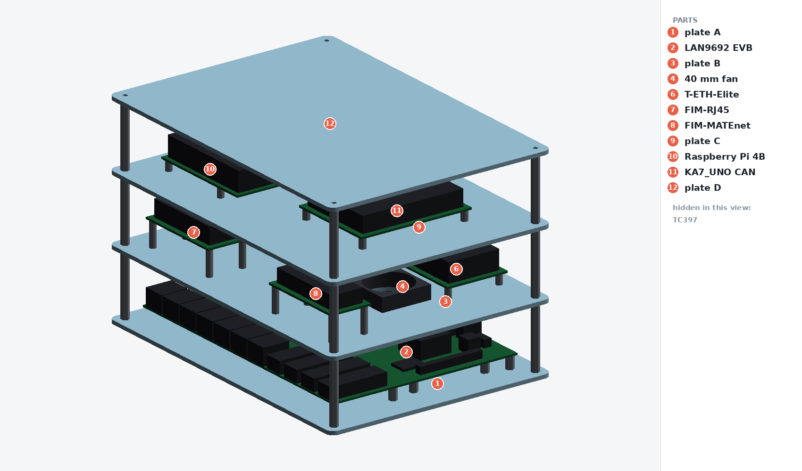

# stl-model

Enclosures for the boards on the KETI TSN bench: one laser-cut acrylic frame
that is the actual build, and printable cases for the individual boards.

**Building the bench → [`acrylic-frame/`](acrylic-frame/)**, and
[`acrylic-frame/CUTTING.md`](acrylic-frame/CUTTING.md) is what goes to the shop.
Nothing in that build is 3D printed.



## The build

Four clear acrylic plates, all 250 × 180 × 3 mm, on M/F standoffs. The LAN9692
lies on the bottom plate; a 40 mm fan sits on **top** of the middle plate and
blows down through a bore onto the switch die, with four boards beside it; the
Raspberry Pi and the CAN board are on the third; the top plate is a plain guard.

| Plate | Thickness | Size | Carries |
|---|---|---|---|
| A bottom | 3 mm | 250 × 180 | LAN9692 on 8 standoffs |
| B middle | 3 mm | 250 × 180 | fan under; TC397, T-ETH-Elite and two fault injection modules on top |
| C top | 3 mm | 250 × 180 | Raspberry Pi 4B and the KA7_UNO CAN board |
| D upper | 3 mm | 250 × 180 | plain guard over them |

Order it as **DXF**, never as STL — laser cutting wants 2D paths and a stated
thickness, not a mesh. `acrylic-frame/dxf/combined-order.dxf` is the single file
to send; `acrylic-frame/acrylic-frame-dxf.zip` is that plus the individual
plates, the cutting notes and the BOM.

`acrylic-frame/assembly.stl` is a **preview of the assembled frame**, not
something to order. It is cut from the same DXFs the shop gets.

## Printable cases

Each of these is a complete alternative to putting that board on the frame.
They are not part of the acrylic order.

| Model | Board | Parts | Volume |
|---|---|---|---|
| [`lan9692-evb-case/`](lan9692-evb-case/) | EVB-LAN9692-LM (EV09P11A) | open tray + lid | 118.5 cm³ |
| ″ | ″ — closed box, vented | tray + 2 panels + lid | 170.2 cm³ |
| ″ | ″ — closed box, ports only | tray + 2 panels + lid | 235.2 cm³ |
| [`lilygo-t-eth-elite-case/`](lilygo-t-eth-elite-case/) | LilyGo T-ETH-Elite | bottom + top | 17.1 cm³ |
| [`tc397-appkit-case/`](tc397-appkit-case/) | AURIX Application Kit TC3X7 | tray + vented lid | 82.9 cm³ |
| [`esp32-s31-coreboard-case/`](esp32-s31-coreboard-case/) | ESP32-S31-Function-CoreBoard-1 | tray + vented lid | 20.7 cm³ |

## Looking at it

**<https://hwkim3330.github.io/stl-model/>** — the frame, the exploded stack, the
CAN board and the LAN9692, spinnable in a browser. It is one self-contained HTML
file with no CDN and no network calls, generated by
[`viewer/make_viewer.py`](viewer/) into `docs/`, so it is a file in this
repository rather than a hosted thing that can rot.

GitHub will also render any STL here in 3D if you click it, e.g.
[`acrylic-frame/assembly.stl`](acrylic-frame/assembly.stl).

## Board models

[`ka7-uno-can-board/`](ka7-uno-can-board/) is not an enclosure — it is the KETI
KA7_UNO REV1 CAN board rebuilt from its own fabrication set, so the acrylic frame
can show the real board and take its hole pattern from fab data. Six layers,
70 × 90 mm, 2 × CAN FD, 2 × 10BASE-T1S, Ethernet and 2 × LIN.

The ESP32-S31 case is **for a different board than the one on this bench** — it
was drawn before the ESP32 board was identified as the LilyGo T-ETH-Elite. The
design is sound and sourced from Espressif's own drawing; it just has no board
here to hold.

For the LAN9692 the printed options are 119–235 cm³, which is where the acrylic
frame came from: cheaper, board visible, and the one unverified dimension
(clearance above the board) becomes a standoff length instead of a reprint.

## Where the numbers come from

Dimensioned from primary sources, not from eyeballing renders:

* **LAN9692** — Microchip's released Gerber/Excellon and pick-and-place files.
  The board outline and all 8 mounting holes are the drill file's own
  coordinates, so plate A cannot be wrong about them.
* **LilyGo T-ETH-Elite** — the published case STLs, measured, checked against
  LilyGo's board CAD.
* **TC397** — Infineon's Application Kit manual drawing.
* **ESP32-S31** — Espressif's dimension PDF, which carries more than the DXF.

Each folder's README says which of its numbers are data and which are
assumptions. The two hole patterns still worth measuring against real hardware
are called out in [`acrylic-frame/CUTTING.md`](acrylic-frame/CUTTING.md).

## Checks

```bash
pip3 install --break-system-packages trimesh manifold3d numpy scipy pillow

python3 check_stls.py                  # every STL: watertight, single body, no degenerate faces
cd acrylic-frame && python3 review.py  # webs, geometry vs DXF, mesh vs DXF, zip freshness, fasteners
```

`review.py` is the one that matters. It rasterises each plate's real DXF to
measure the material left between cuts, matches every intended cut by position
*and* size with stray detection, checks that the 3D preview was cut from those
same DXFs, checks the order zip against the files on disk, and counts screw
positions against the BOM. It exists because counting features per plate once
passed a plate whose coordinates were wrong.

## Regenerating

```bash
cd acrylic-frame
python3 make_plates.py     # dxf/*.dxf + acrylic-frame-dxf.zip
python3 bom.py             # BOM.csv
python3 render_all.py      # img/*.png + assembly.stl
python3 review.py

cd ../lan9692-evb-case  && python3 lan9692_case.py && python3 lan9692_box.py && python3 lan9692_box.py --solid
cd ../tc397-appkit-case && python3 tc397_appkit_case.py
cd ../lilygo-t-eth-elite-case && python3 fit_for_print.py
cd .. && python3 stack_preview.py
```

## Printing, if you print

JLC3DP and JLCPCB share one cart, so printed parts can ship with a PCB order —
from the JLC3DP order page use the PCB/PCBA tab, then combine payment.
<https://jlc3dp.com/help/article/how-to-combine-orders-for-jlc3dp-and-jlcpcb-products>

| | LilyGo case | LAN9692 case |
|---|---|---|
| Files | the **`_fit`** pair, not the originals | open tray, or the 4-part closed box |
| Material | MJF PA12-HP Nylon | MJF PA12, or FDM ABS/PETG to save money |
| Why | flexing button tabs, PoE heat, no support marks | at 119 cm³ volume-priced MJF costs ~7× the small case |

The `_fit` variants exist because the published LilyGo case has a 0.4 mm/side
cavity clearance and a 0.5 mm lip, both inside MJF's ±0.3 mm tolerance — it
would print unassemblable. `fit_for_print.py` opens them up.

**Order a LAN9692 tray before its lid.** Everything else is fab data, but the
clearance above the board is a judgement call from photos, and it is the only
number the lid depends on.

## Licence

`lilygo-t-eth-elite-case/` contains Cicicok's Printables model 1154843, CC BY —
the `_fit` variants and `adapter_lilygo` are derivatives of it. Everything else
is original.
