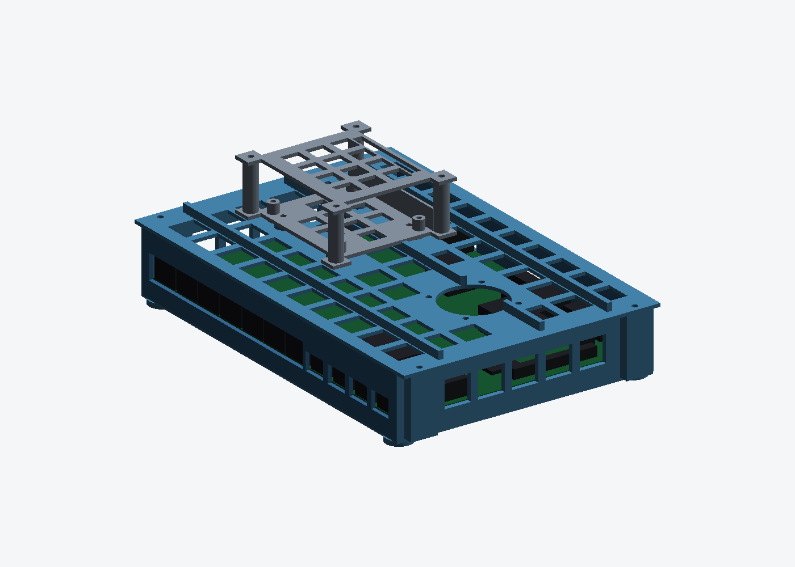

# stl-model

3D-printable enclosures for the boards on the KETI TSN bench.

| Model | Board | Parts | Material volume |
|---|---|---|---|
| [`acrylic-frame/`](acrylic-frame/) | LAN9692 + fan + module trays | **3 laser-cut plates (DXF)** | 250 × 180 mm × 3 |
| [`lan9692-evb-case/`](lan9692-evb-case/) | Microchip EVB-LAN9692-LM (EV09P11A) | open tray + lid | 118.5 cm³ |
| [`lan9692-evb-case/`](lan9692-evb-case/) | ″ — closed box, vented | tray + 2 panels + lid | 163.5 cm³ |
| [`lan9692-evb-case/`](lan9692-evb-case/) | ″ — closed box, ports only | tray + 2 panels + lid | 237.2 cm³ |
| [`lilygo-t-eth-elite-case/`](lilygo-t-eth-elite-case/) | LilyGo T-ETH-Elite + PoE base board | bottom + top | 17.1 cm³ |
| [`esp32-s31-coreboard-case/`](esp32-s31-coreboard-case/) | ESP32-S31-Function-CoreBoard-1 | tray + vented lid | 26.5 cm³ |
| [`tc397-appkit-case/`](tc397-appkit-case/) | AURIX Application Kit TC3X7 (TC397/TC387, 100 × 100) | tray + vented lid | 82.9 cm³ |

Everything is dimensioned from primary sources, not from drawings or eyeballing:
the LAN9692 parts from Microchip's released Gerber/Excellon and pick-and-place
files, the LilyGo `_fit` variants from measurements of the published STLs checked
against LilyGo's own board CAD, the ESP32-S31 tray from Espressif's dimension
DXF, the TC397 tray from Infineon's Application Kit manual drawing. Each folder's README states which numbers are data and which are not.

## Plates or a printed box

For the LAN9692 the printed enclosures are big — 118 to 237 cm³ depending on
style. [`acrylic-frame/`](acrylic-frame/) does the same job as three laser-cut
250 × 180 mm plates plus standoffs: cheaper, board visible, and the unverified
clearance above the board becomes a standoff length instead of a reprint. The
printed trays stay useful for the small boards, and plate B's slots use the same
45 mm square as the printed lid's deck, so they interchange.

**Acrylic is ordered from DXF, never from STL** — laser cutting needs 2D vector
paths and a stated thickness, not a mesh. See
[`acrylic-frame/CUTTING.md`](acrylic-frame/CUTTING.md).

## Stacking and cooling



The LAN9692 box lid carries a **40 mm fan** centred on the switch die and a
**deck of 4 × M3 bosses on a 45 mm square**. The ESP32-S31 and TC397 trays have
matching Ø3.4 holes through their floors, so either bolts on top in either
orientation:

```bash
python3 stack_preview.py    # -> img/stack_s31.png, img/stack_tc397.png
```

The board has no fan header — run the fan off the expansion header's 5 V
(budgeted 2.0 A) or off the 12 V jack net.

## Ordering

JLC3DP and JLCPCB share one cart, so these can ship with a PCB order — from the
JLC3DP order page use the PCB/PCBA tab in the nav bar, then combine payment.
<https://jlc3dp.com/help/article/how-to-combine-orders-for-jlc3dp-and-jlcpcb-products>

| | LilyGo case | LAN9692 tray + lid |
|---|---|---|
| Files | the **`_fit`** pair, not the originals | open tray, or the 4-part closed box |
| Material | MJF PA12-HP Nylon | MJF PA12-HP Nylon, or FDM ABS/PETG to save money |
| Why | flexing button tabs, PoE heat, no support marks | PA12 prints it as-is; at 119 cm³ the volume-priced MJF costs ~7× the small case |

One material for everything is fine — the split is purely a cost call, and
mixing processes does not stop the order shipping together.

```bash
python3 check_stls.py    # every STL: watertight, single body, no degenerate faces
```

## What to actually order

| | Qty | File(s) | Material |
|---|---|---|---|
| LilyGo case | 2 sets (buttons get lost) | `*_bottom_fit.stl`, `*_top_fit.stl` | MJF PA12 |
| ESP32-S31 case | 1 | `esp32_s31_tray.stl`, `esp32_s31_lid.stl` | MJF PA12 or FDM |
| LAN9692 | 1 | pick **one** of the three styles | FDM ABS/PETG if the 163–237 cm³ MJF price stings |
| Fasteners | — | 8 × M3 × 8 + 4 × M3 × 10 per LAN9692 case, 4 × M3 × 10 for the S31 | thread-forming |

**Order the LAN9692 tray before the lid.** Everything else is fab data, but the
26 mm of clearance above the board is a judgement call from board photos, and it
is the only number the lid depends on. Print the tray, fit the board, measure,
then order.
