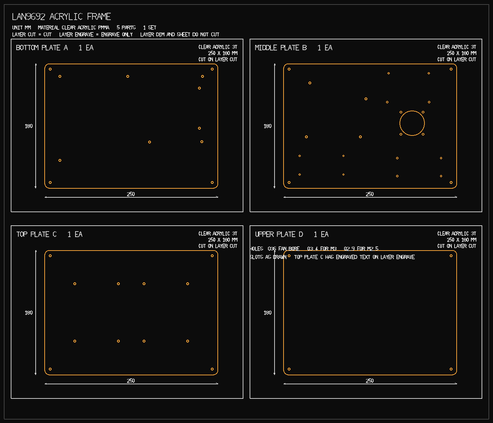
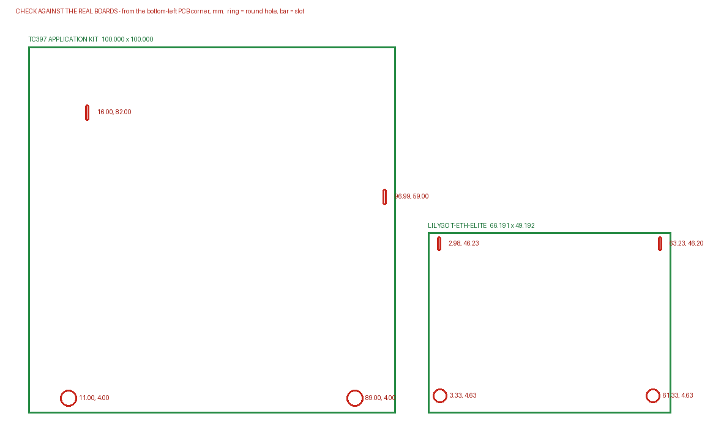

# Cutting order — LAN9692 acrylic frame

**Send `combined-order.dxf`.** One 700 × 600 mm sheet laid out the way the
shop's own example sheet is: a framed cell per part, part name and quantity at
the top left, material / thickness / size stacked at the top right, and the
overall dimensions on each part. The individual plate files are in the same zip
if they would rather have them separately.



Text on the drawing is ASCII so it always renders, whatever CAD the shop uses.
The Korean equivalents for the order mail:

```
투명 아크릴 3T   250 x 180 mm   4EA   (하판 A, 중판 B, 상판 C, 최상판 D)
CUT 레이어 = 절단,  DIM/SHEET 레이어 = 가공 없음
각인 없음
```

**Four plates, all 250 × 180 mm, all clear 3 mm** — one thickness for the whole
order. The small sub-plates are gone, and so is the engraving.

| Plate | File | Material | Size | Qty |
|---|---|---|---|---:|
| A — bottom | `plate-a-bottom-3T.dxf` | clear acrylic (PMMA) 3 mm | 250 × 180 mm | 1 |
| B — middle | `plate-b-middle-3T.dxf` | clear acrylic 3 mm | 250 × 180 mm | 1 |
| C — top | `plate-c-top-3T.dxf` | clear acrylic 3 mm | 250 × 180 mm | 1 |
| D — upper | `plate-d-upper-3T.dxf` | clear acrylic 3 mm | 250 × 180 mm | 1 |

* Units are **millimetres** (R12 DXF, `$INSUNITS = 4`).
* Everything on layer **`CUT`** is a cut path — outline, holes and slots alike.
* There is **no engraving** — no `ENGRAVE` layer is emitted at all, so no second
  operation and no charge for one.
* Layers `TEXT`, `DIM` and `SHEET` are drawing annotation and stock outline;
  none of them cut.
* Holes: **Ø3.4** (M3 free fit), **Ø2.9** (M2.5), and one **Ø36** fan bore.
  Ø36 rather than Ø38 because at the fan's 32 mm screw pitch a Ø38 bore would
  leave only 1.93 mm of acrylic to each screw hole; Ø36 leaves 2.93.
* Kerf compensation: leave it to the shop. Every fit here is a clearance fit.

## No engraving

The KETI mark is not approved for use here, so nothing is engraved and the
`ENGRAVE` layer is not written to the DXF at all. That also removes the second
operation from the order, and its charge. The machinery is still in
`make_plates.py` — one line, `ENGRAVE = [(x, y, height, 'TEXT')]` — if approved
artwork ever turns up. Engraving artwork has to be **vector** (AI / SVG / DXF).

## One column line, at the four corners

**Every plate has the same four holes**, at (8, 8) (242, 8) (8, 172) (242, 172),
and nothing else about the columns differs between plates.

The column is **M/F standoffs, all fitted male end up**. Each one's 6 mm stud
crosses the plate above it and threads into the standoff beyond, so one hole per
corner serves the joint below and the one above:

| | through | thread engaged |
|---|---|---|
| M/F stud at plate B, C, D | **3 mm** | **3.0 mm** |
| the same stud through a 5 mm plate | 5 mm | 1.0 mm — will not bite |

**That is why every plate is 3 mm.** It is the thickness the standoffs already
bought are made to stack through.

The column is: screw up through plate A → standoff → stud through plate B →
standoff → stud through plate C → standoff → stud through plate D → **nut**.
Three standoffs per corner, four corners, twelve in all.

## The fourth tier, plate D

Plate D carries the CAN board, or the 7-inch display. **Neither hole pattern is
settled**, so it ships with the four column holes and nothing else — 4 cuts, the
simplest plate in the set.

### Plate C carries the Raspberry Pi

From `RP-008343-DS-1`, the Pi 4 Model B official mechanical drawing:

| | |
|---|---|
| Board | 85 × 56 mm, corner radius 3.0 |
| Holes | 3.5 mm in from the left and top edges → **58.0 × 49.0 pitch** |
| Cut as | Ø2.9 round, M2.5 |
| Placed | centre (66, 44) — USB/Ethernet edge to the front rim, power/HDMI edge to the left, 9.5 mm clear of the corner column |
| Tallest part | **16.0 mm**, the USB stacks (RJ45 is 13.5, GPIO header 8.5) |

On 8 mm standoffs the Pi tops out at 134.6 mm with **24.4 mm clear under plate
D** — room for the display's ribbon to turn.

The same 58.0 × 49.0 appears on the 7-inch display's own drawing, for the Pi it
carries, so the two sources agree.

### The 7-inch display, when you want it

From `RP-008246-DS-1`, the official mechanical drawing:

| | |
|---|---|
| Module outline | 192.96 × 110.76 mm — fits plate D with 28 mm to spare each way |
| Active area | 154.08 × 85.92 mm |
| Thickness | ≈ 5.96 mm plus the FPC tails |
| Mounting | **two** patterns on the back: 4 × M2.5 and 4 × M3.0, at 58.0 × 49.0 and 126.2 × 65.85 |

58.0 × 49.0 is the Pi 4's own pattern — now confirmed against `RP-008343-DS-1` —
so that is where a Pi bolts to the display's back, on the M2.5 thread, and
126.2 × 65.85 is the display's own M3 mounting.

**No display holes are cut yet, and the reason is the datum, not the pitch.** The
drawing gives 126.2 × 65.85 but its right-hand view dimensions (166.2, 164.9,
11.89, 12.54, 20.0, 48.45) do not resolve against the 192.96 × 110.76 lens
outline on the left-hand view — the two views are measuring different things, the
lens and the metal frame. Where that rectangle sits inside the outline is what a
plate needs, and guessing it scraps the plate.

Two ways to settle it, both cheap: measure from one corner of the real display to
two adjacent holes, or find the display's DXF/STEP. Plate D is four cuts — the
cheapest plate here to re-cut once the number is known.

**No vents anywhere.** They were cut when the fan hung *under* plate B and drew
down through the bore, which put plate C in the intake path. The fan now sits on
**top** of plate B, like every other board on that plate, and blows down through
the bore onto the switch — same airflow, but it draws from the B–C gap, which is
50 mm and open on all four sides. Slots in plate C or D would be drawing from the
same air.

Putting the fan on top also gives the LAN9692 back the space it was eating:
clearance from the board's tallest part to plate B goes from 13.5 mm to
**24.5 mm**, and every fastener on plate B is now reached from above.

```
3 + 50 + 3 + 50 + 3 + 50 + 3 = 162 mm
```

Exactly 180 is **not reachable at 3 mm**: 12 mm of plate needs the gaps to sum to
168 and standoffs come in 5 mm steps. The near misses are 177 (50 + 55 + 60) and
182 (55 + 55 + 60). 162 keeps one standoff length for the whole column.

### Plate A and sag

3 mm on a 250 × 180 plate carried at four corners is thin for the plate holding
the board. Day one, across the 250 mm span:

| | 400 g board | |
|---|---|---|
| 3 mm | ≈ 1.0 mm | acrylic also creeps under a standing load |
| 5 mm | ≈ 0.2 mm | |

About a millimetre is liveable, and there is 13.5 mm of clearance under the fan
to give away. If it does sag, **plate A alone can be re-cut in 5 mm with no
hardware change at all** — nothing crosses plate A, it only takes a screw up into
the first standoff. Plates B, C and D cannot: a stud passes through each of them.

## Plates D and E are gone

The two small sub-plates existed so a module could ride on its own carrier
instead of bolting to plate B. Every board now bolts straight down, so the
carriers and plate B's 35 × 45 deck pattern went with them — eight fewer holes in
plate B and two fewer parts to order. `plate-d-upper-3T.dxf` is the new fourth
tier and has nothing to do with the old sub-plate D.

## Plate B changed — revision 3

Plate B was re-solved, not patched. **If plate B has already been cut it needs
re-cutting.** It now carries four boards and has lost the 35 × 45 deck pattern
along with the sub-plates.

**Both** injection modules are fitted, the RJ45 build and the MATEnet build. An
earlier attempt dropped the second one into the 47.6 mm corridor between the
TC397 and the fan bore, which left 6.8 mm of acrylic each side — legal, and mean.
Re-solving the whole plate instead of squeezing into what was left gives every
board **at least 20 mm to its nearest neighbour**.

| Board | Centre | Turned | Footprint |
|---|---|---|---|
| TC397 | (72, 120) | — | x 22…122, y 70…170 |
| T-ETH-Elite | (180, 146) | **180°** | x 146.9…213.1, y 121.4…170.6 |
| FIM-RJ45 | (55, 33) | — | x 20.2…89.8, y 16…50 |
| FIM-MATEnet | (196, 30) | — | x 161.2…230.8, y 13.6…46.4 |

The **T-ETH-Elite is turned 180°** so its USB-C faces the back rim instead of
pointing into the middle of the plate. That, with the TC397 beside it, clears the
whole front of the plate — which is where the two injection modules go, one per
half.

| Clearance | |
|---|---|
| TC397 ↔ T-ETH-Elite | 24.9 mm |
| TC397 ↔ FIM-RJ45 | 20.0 mm |
| FIM-RJ45 ↔ FIM-MATEnet | 71.4 mm |
| any board ↔ nearest column | 5.2 mm |
| thinnest web anywhere on plate B | 3.36 mm |

That 71.4 mm between the modules is deliberate. Their two facing connectors need
room for **two plugs nose to nose** — about 44 mm of plug body before any cable
bend — and at 56 mm it was tight enough to bend cables sharply, so both boards
were pushed outward until the column holes started to crowd.

### The injection modules

Outline from `Edge_Cuts.gm1`, mounts from the Ø2.5 tool in `PTH.drl`, so unlike
the TC397 and the T-ETH-Elite these are **cut plain round with no slots** —
drill-file coordinates carry no uncertainty for a slot to absorb.

| | RJ45 build | MATEnet build |
|---|---|---|
| Outline | 69.585 × 34.000 mm | 69.585 × 32.881 mm |
| Mount pattern | 63.25 × **27.025** | 63.25 × **26.000** |
| Acrylic hole | Ø2.9, M2.5 | Ø2.9, M2.5 |

**The two patterns differ by 1.025 mm in y**, so each zone takes only its own
board — they are not interchangeable, and plate B is cut with one of each.

Both put their two connectors on **opposite short edges**, traffic in one side
and out the other; on the MATEnet board the Ø2.261 pegs at x = 4.085 and
x = 65.585 are what show that. Left flat, both modules therefore face left and
right along the plate's X axis: the outer connector of each has a clear run to
its own side rim, and the inner two face each other across the 71.4 mm gap.

Their other drilled holes — Ø3.15 NPTH and Ø1.7 PTH on the RJ45 board, Ø2.261
NPTH on the MATEnet one — are the connectors' pegs and shield tabs, **not**
mounting points. No acrylic is cut for them.

## Check two hole patterns before sending

Plate A's eight holes came out of the LAN9692's **Excellon drill file** and are
exact. The two small boards' holes came off **drawings**, and that is the only
error here that could scrap a plate:



They look wrong because neither pattern is a rectangle. The TC397 has two holes
on its front edge plus one on the right at mid-height and one on the left near
the top; the T-ETH-Elite's corner holes are 58.00 mm apart at the bottom against
60.25 at the top — two independent LilyGo files agree on that to 0.04 mm.

| | source | if the hole is not there |
|---|---|---|
| LAN9692, 8 holes | drill file | n/a, exact |
| TC397 (11, 4), (89, 4) | Ø6 pads, unambiguous in figure 7-7 | n/a |
| TC397 (96.99, 59), (16, 82) | Ø4 pads, dimensioned but not proven | leave that screw out and prop the corner with an adhesive nylon standoff |
| T-ETH-Elite, 4 holes | LilyGo 2D DXF + 3D CAD | measure and re-cut plate B |

Two of the four mounts per board are cut as **9 mm slots** rather than round
holes, so a misread of ±2.8 mm in X still bolts up; the other two are round and
locate the board so it cannot slide while being tightened. Setting
`MOUNT_SLOT = 0` in `make_plates.py` turns all of them into plain holes once the
boards have been measured. (`3.4` is not enough — it only rounds the Ø3.4 TC397
mounts and leaves the Ø2.9 T-ETH-Elite pair as short stadiums.)

## Two separate orders

The laser shop cuts plates and nothing else. Standoffs, screws, the fan and the
DC parts come from an electronics supplier. **Nothing is 3D printed.**

| Order | Where | What |
|---|---|---|
| 1 | laser / acrylic shop | `combined-order.dxf` |
| 2 | electronics parts supplier | the tables below, and `BOM.csv` |

Some shops resell M3 hardware, so it costs nothing to ask in the order note — but
a 45 mm threaded standoff is turned metal or moulded nylon, a different trade.

## Hardware

Part numbers in `BOM.csv`. Split it across three suppliers: **RS Korea** for
screws, nuts, standoffs and feet; **DigiKey Korea** for the washers, the power
supply and the barrel socket; a domestic shop for the fan and the Y splitter.

| Part | Size | Qty | Part number | Note |
|---|---|---:|---|---|
| Hex standoff F/F | M3 × 10 mm | 8 | RS 224-0443 | LAN9692 on plate A |
| **Hex standoff M/F** | **M3 × 50 mm, 6 mm stud** | **12** | 디바이스마트 PCB서포트 금속 F-50mm | the whole column, 4 per gap — 10 already bought, 2 more needed |
| Hex standoff F/F | **M3 × 20 mm** | 4 | — | TC397 |
| Hex standoff F/F | **M2.5 × 20 mm** | 12 | — | T-ETH-Elite and both modules |
| Screw, pan head | M3 × 6 / 8 mm | 12 / 16 | RS 190-428 / 797-6193 | at 3 mm of plate an M3 × 8 reaches everywhere a 10 used to |
| Screw, pan head | **M3 × 25 mm** | 4 | RS 914-1490 | fan only — see below |
| Screw, pan head | M2.5 × 6 / 8 mm | 12 / 12 | RS 528-716 / 797-6190 | T-ETH-Elite and both modules |
| Nut, nyloc | M3 | 12 | RS 521-917 | 4 for the fan, 4 on the column studs at plate D, rest spare |
| Washer, nylon | M3 | 40 | Essentra MFW030A | under any head landing on acrylic |
| Nylon standoff, adhesive base | 8 mm | 2 | — | fallback props for the TC397 |
| Rubber foot | self-adhesive | 4 | RS 136-8964 | under plate A |

The two 45 mm and 10 mm standoffs are confirmed **Female/Female** on RS's own
page; RS's M/F parts in the same range have a 6 mm stud, which is exactly why
they cannot be used here. The rest of the numbers came in unverified — read the
description before you click buy.

### Buying it all domestically instead

The part numbers above exist to pin the *specification*, not the shop — every
line is a generic item, so a domestic order is reasonable. How far that was
actually confirmed, rather than assumed:

| Line | Domestic stock |
|---|---|
| M3 standoffs, screws, nyloc nuts, nylon washers | **found** — see the order below. 50 mm in place of 45 mm |
| **M2.5 F/F 8 mm standoff** | **not found in that order, and it is the one real gap** |
| female 5.5 × 2.5 pigtail | **found**: `AM2826`. Its sibling `AM2825` is the male version — easy to order by mistake |
| Y splitter | **found**: `NC066`, listed 5.5 × 2.5. The same Coms family also ships a 2.1, so check the part on arrival |
| 12 V 5 A adapter | not in that order |

Whichever way it is bought, three things decide whether it assembles:

| Check | Why |
|---|---|
| standoff is **암‑암 (F/F)**, not 암‑수 | a male stud cannot cross a 5 mm plate and still bite |
| barrel is **5.5 × 2.5**, not 5.5 × 2.1 | the board's PJ-002BH is 2.5; 2.1 contacts badly |
| socket is **female**, splitter is **female‑in / male‑out** | the adapter is male, so anything else leaves you male-to-male |

**If 45 mm standoffs are not stocked, use 50 mm.** The plates are 2D and do not
depend on it: the stack simply becomes 5 + 50 + 5 + 50 + 3 = 113 mm, and both
gaps get *more* clearance — more room over the LAN9692's unmeasured DC-DC
modules, more over the TC397. Going the other way is what needs care: 40 mm
leaves only about 2 mm above a 38 mm TC397 case.

A domestic order also settles 세금계산서 in one step, which a foreign
distributor does not.

### What was actually bought

디바이스마트, 2026-08-18. This is the set the frame was assembled from, so it
is the list to repeat rather than the imported part numbers above.

| Design line | Bought | Qty |
|---|---|---:|
| M3 F/F 10 mm — LAN9692 | PCB서포트 **플라스틱** F-10mm | 10 |
| M3 F/F 45 mm — columns | PCB서포트 금속 **F-50mm** | 10 |
| M3 F/F 8 mm — TC397 | M3 알루미늄 서포트 Female 8mm `SZH-ZR058` | 4 |
| M3 × 6 / 8 / 10 | 둥근머리 십자볼트 (니켈) | 20 each |
| M3 × 25 — fan | 스텐 둥근머리 십자볼트 M3x25 | 20 |
| M2.5 × 6 / 10 | 스텐 둥근머리 십자볼트 | 20 each |
| M3 nyloc nut | 로크(나일론)너트 M3 | 10 |
| M3 nylon washer | `MFW030A` | 20 |
| fan | Noctua NF-A4x10 FLX | 1 |
| female 5.5 × 2.5 pigtail | `AM2826` DC 2선 to DC 잭 Female(암), 0.3 m | 1 |
| male 5.5 × 2.5 pigtail | `VLT-CAB124` 27 cm AWG18 | 2 |
| female jack, screwless | `VLT-DC037` 푸쉬 터미널 | 1 |
| Y splitter | `NC066` Coms 2분배 35 cm, on/off | 1 |
| Y junction, solderless | 원터치 커넥터 WAGO `221-413` (3핀) | 2 |

**Still to buy: 4 × M2.5 F/F 8 mm standoffs** for the T-ETH-Elite. Nothing
substitutes — plate B's holes for that board are Ø2.9, so an M3 screw will not
pass, and an M2.5 screw will not bite in an M3 standoff. Everything else on the
frame assembles without them; only that one board waits. **And a 12 V 5 A
adapter**, 5.5 × 2.5 centre positive, which is not in the order.

Two things to do differently from the tables above, given what arrived:

* **Use M3 × 10, not M3 × 8, into the plastic 10 mm standoffs.** Plate A is 5 mm,
  so an M3 × 8 engages only 3 mm, and 3 mm of plastic thread under the weight of
  the board is thin. There are 8 spare M3 × 10 after the columns and the TC397.
* **Feed the board through the WAGO and the AWG18 pigtail, not through NC066.**
  The board can draw 4.1 A and the splitter's wire gauge is not published;
  Coms cables in this family are usually 20–22 AWG. NC066 is better used on the
  fan leg, where the load is 0.05 A and its switch is actually handy.

The WAGO 221-413 is a 3-conductor lever connector, so two of them make the whole
Y — one for +12 V, one for ground, each taking the adapter in and the board and
fan out. No soldering anywhere in the power path.

**The LAN9692's own drill is Ø3.048 mm**, so an M3 screw is a very tight fit
through the board. Try one by hand first; if it binds, use M2.5 for the
board→plate A joint. The Ø3.4 acrylic hole takes either.

### Why F/F standoffs plus studs, and not M/F

An M/F standoff's male stud is 6 mm. Through a 5 mm plate that leaves 1 mm — not
enough thread to bite anything. So the standoffs are plain **F/F** and what
crosses each plate is a **threaded stud**, screwed into the standoff on both
sides. That is what collapsed two column lines into one at the four corners.

Stack height ≈ 5 + 45 + 5 + 45 + 3 = **103 mm**, or **113 mm** on the
50 mm standoffs that were actually bought.

## Electrical

| Part | Spec | Qty | Part number |
|---|---|---:|---|
| Fan | 40 × 40 × 10 mm, **12 V**, 0.6 W | 1 | Noctua NF-A4x10 FLX |
| DC adapter | 12 V 5 A, barrel 5.5 × 2.5 × 11 mm, centre + | 1 | Mean Well **GST60A12-P1M** |
| Barrel socket, female → bare leads | 5.5 × 2.5 mm, 18 AWG, 305 mm | 1 | Tensility **10-02879** (DK 839-10-02879-ND) |
| DC splitter | barrel 5.5 × 2.5, **1 female in → 2 male out** | 1 | domestic, generic |

```
GST60A12-P1M ──> Y splitter ─┬─> LAN9692 J23    (5.5 x 2.5, centre +)
  12 V 5 A                   └─> 10-02879 socket ──> Noctua NF-A4x10
```

* Nothing is tapped on the PCB — **the board has no fan header.**
* The board's jack is 5.5 / **2.5** mm (PJ-002BH). Most cheap splitters are
  5.5 / 2.1 and contact badly; get the 2.5. On the Mean Well the suffix is what
  decides it — **P1M is 2.5 mm, P1J is 2.1** on the otherwise identical supply.
* **Genders**: the adapter is male, so the splitter is female-in / male-out and
  the fan lead needs a **female socket**. A plug leaves you male-to-male.
* Never feed 24 V: the board's input TVS is an SMBJ13D, 13 V standoff.

### Wiring the fan to the socket

The 10-02879 is a female barrel jack on a 305 mm 18 AWG red/black pigtail, rated
6 A — far more than the fan's 0.05 A. Join it to the fan's **included extension
cable**, not to the fan's own lead: if the socket ever has to change, the fan is
still original.

1. Cut the extension cable a comfortable distance from its female end and keep
   the length that plugs into the fan.
2. The Noctua lead has three conductors. **Only two are used** — supply and
   ground. The third is the tacho signal and goes nowhere; cut it back and
   insulate it separately.
3. **Meter the socket before soldering.** Which of red/black is the centre pin
   is not in Tensility's datasheet, and the centre pin is the one that must be
   +12 V. Put a plug in the socket, or probe the barrel's inner sleeve, and
   check continuity to each lead.
4. Solder centre-pin lead → fan supply, sleeve lead → fan ground. Heatshrink
   each joint separately, then a larger piece over both.
5. Before it goes near the board: plug the socket into the adapter on its own
   and confirm the fan spins and blows **downward**, toward plate A. The label
   side of a fan is its outlet.

Getting this backwards will not usually kill a Noctua — it stalls or turns the
wrong way — but a reversed feed reaching the LAN9692 through the splitter would
be a different story, which is why the fan is tested on its own first.

### Why M3 × 25 for the fan and not M3 × 20

```
plate B      5.0 mm
fan frame   10.0        Noctua NF-A4x10, published
washer       0.5
nyloc nut    4.0        DIN 985 is taller than a plain M3 nut
-------------------
            19.5 mm engaged
```

An M3 × 20 has 0.5 mm to spare, and a nyloc needs the screw to come *through*
the nylon insert to lock at all. M3 × 25 leaves 5.5 mm proud, which is untidy and
works. The Ø3.4 holes in plate B do not change either way. The screws in the
fan's own box are fatter and want Ø4.5 holes — do not use them.

## The one measurement still worth taking

The LAN9692's five DC-DC daughter modules have no published height. The fan
underside sits at z = 39 mm and the PCB top at 16.5, so anything up to
**22.5 mm** above the PCB clears it — allowing 3 mm of margin, check that the
tallest module is under about **19 mm**. If it is taller, lengthen the four A→B
standoffs; the plates do not change.
