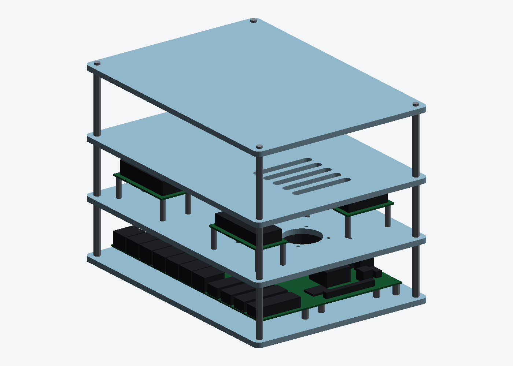
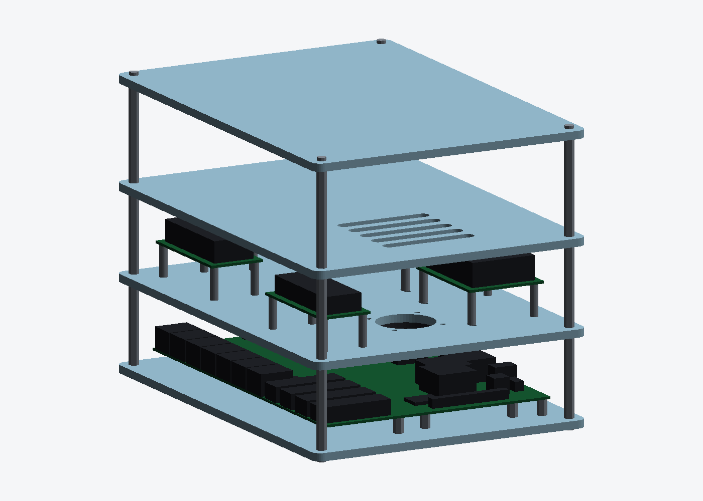
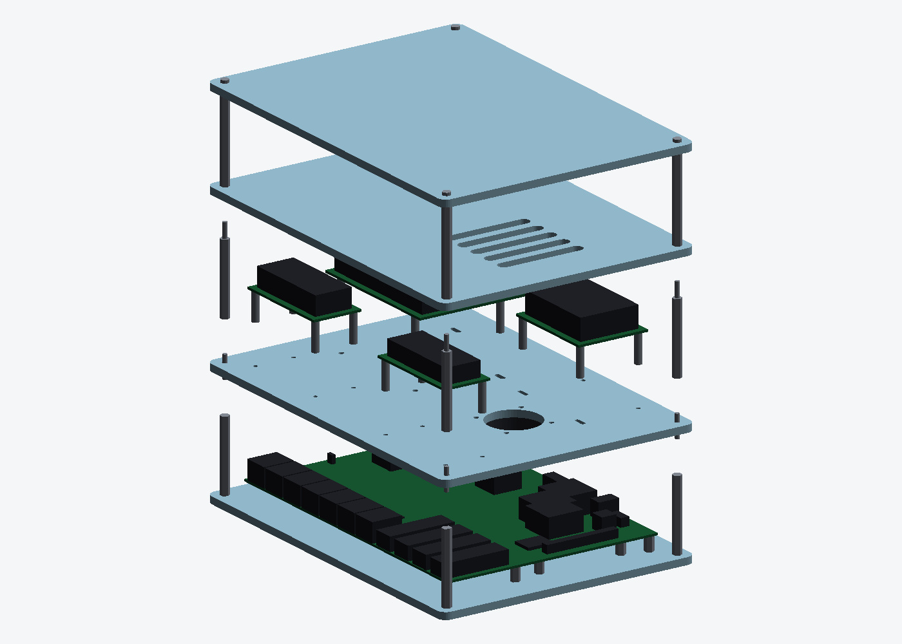
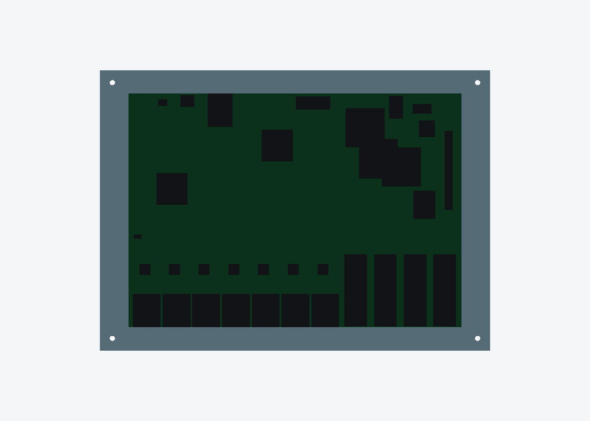
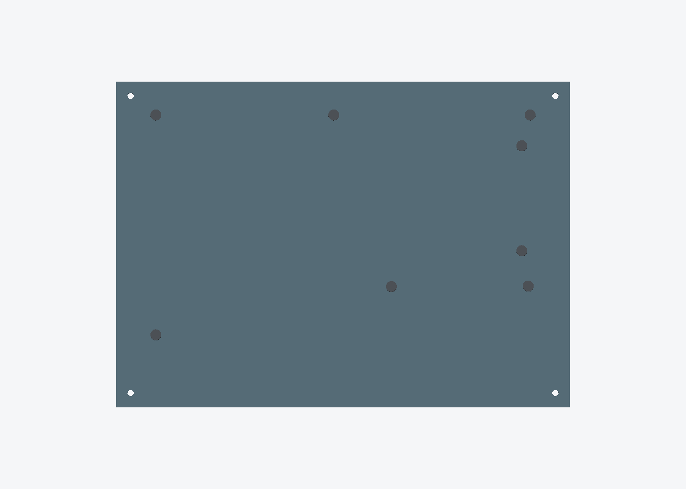
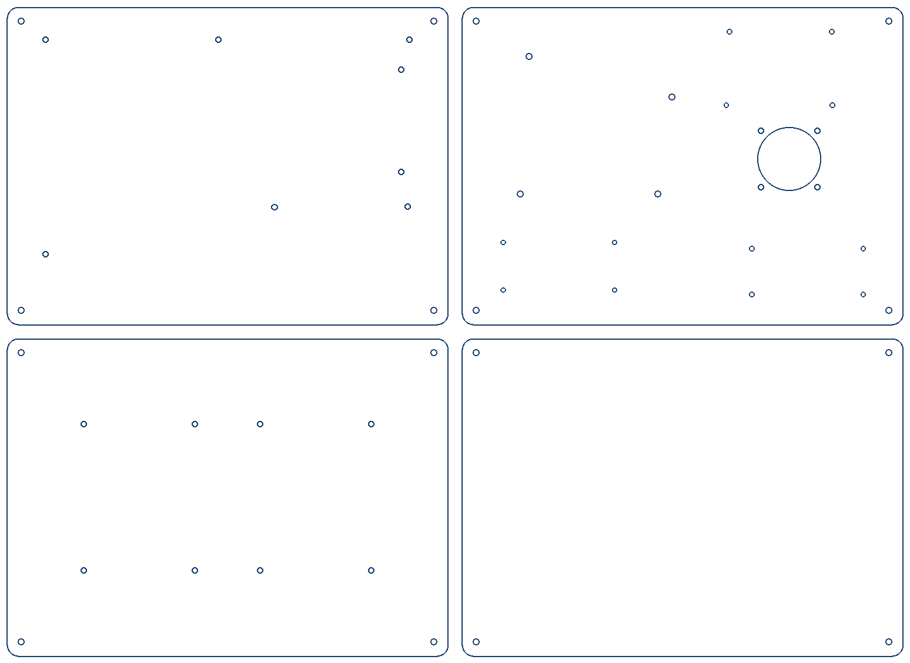
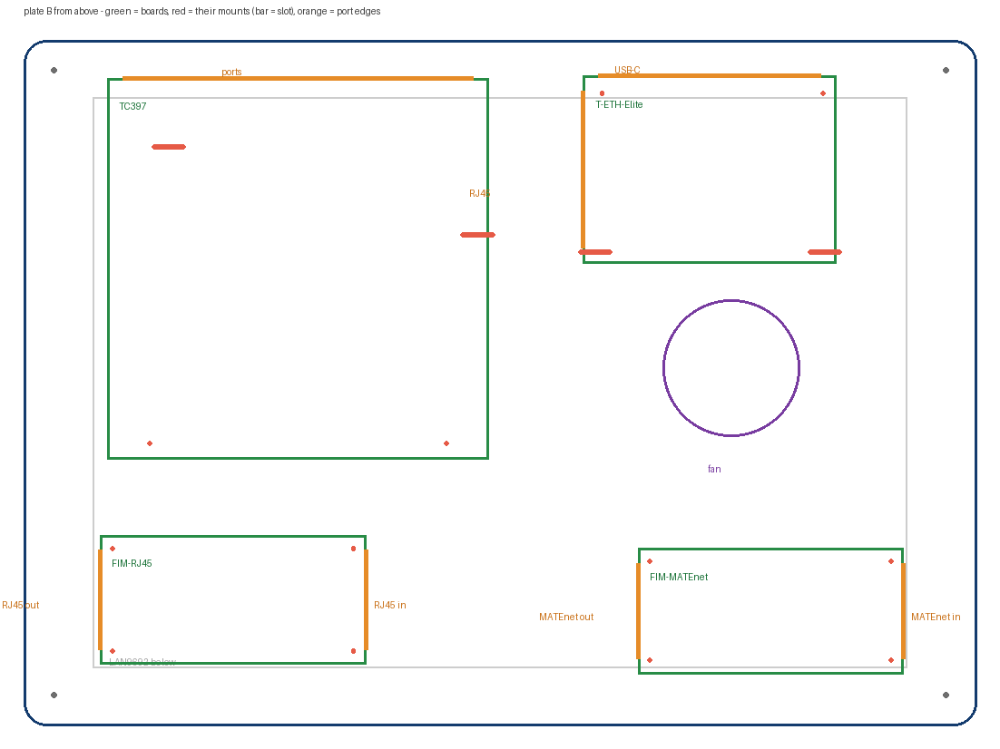

# LAN9692 acrylic frame

Four laser-cut plates, all 250 × 180 × 5 mm, instead of a printed box. Order file:
**[`acrylic-frame-dxf.zip`](acrylic-frame-dxf.zip)** — see [CUTTING.md](CUTTING.md)
for the material/thickness/quantity table and the hardware list.





`assembly.py` builds the whole stack in 3D from the same constants the DXFs come
from, so the plates here and the plates the cutter gets cannot drift apart. It
is a picture, not a printable part — `assembly.stl`, 250 × 180 × 160 mm over
the screw heads.
`ACRYLIC_ONLY = False` at the top swaps the bare boards back for the printed
cases.




Plate A with the LAN9692 on it, and the same plate with the board hidden so the
eight standoffs are visible in their holes. It runs its own checks:

```
hole 1 board (  3.556,146.304) -> plate ( 21.876,161.374)  on plate=True  nearest corner standoff  17.5 mm
...
fan bore centre  (185.63, 93.76)
  switch at plate (185.63, 93.76)   offset 0.000 mm

vertical stack
  plate A               0.0 ..    5.0
  PCB                  15.0 ..   16.5
  tallest part top     30.5   (DC-DC U3, ADM00987, assumed)
  fan                  40.0 ..   50.0   clearance to board   9.5 mm
  plate B              50.0 ..   55.0
  tallest module top   84.6   clearance to plate C  15.4 mm
  plate C             100.0 ..  103.0

fastener engagement  (screw length - what it passes through)
  LAN9692 standoff, from under plate A   M3 x  8.0 through 5.0 mm -> 3.0 mm   OK
  A->B standoff, from under plate A      M3 x 10.0 through 5.0 mm -> 5.0 mm   OK
  A->B standoff, from above plate B      M3 x 10.0 through 5.0 mm -> 5.0 mm   OK
  B->C standoff, from under plate B      M3 x  8.0 through 5.0 mm -> 3.0 mm   OK
  B->C standoff, from above plate C      M3 x  8.0 through 3.0 mm -> 5.0 mm   OK
```

The two clearances are the ones worth watching. Both are computed against the
**assumed** 14 mm DC-DC module height — measure a module and rerun; if it comes
out taller, `H_AB` at the top of `assembly.py` is the standoff to lengthen, and
nothing else in the design changes.



**Nothing here is 3D printed.** Four laser-cut plates and hardware.

| Plate | Material | Size | Carries |
|---|---|---|---|
| A — bottom | 5 mm clear acrylic | 250 × 180 mm | LAN9692 on 8 × M3 standoffs |
| B — middle | 5 mm clear acrylic | 250 × 180 mm | 40 mm fan underneath; four boards on top |
| C — top | 5 mm clear | 250 × 180 mm | guard, intake slots over the fan |
| D — upper | 5 mm clear | 250 × 180 mm | fourth tier for the CAN board or an LCD; 4 holes, nothing else |

All four boards bolt **straight to plate B**, cut with each board's own pattern:
the TC397's four holes, the T-ETH-Elite's four asymmetric ones, and four each for
the RJ45 and MATEnet fault injection modules. No sub-plates.



The mount features are **9 mm slots**, not round holes. Plate A's pattern is from
the LAN9692's drill file and exact; these two came off drawings, so the slots buy
±2.8 mm in case a coordinate is misread — see `CUTTING.md` for a check sheet to
hold against the real boards.

Positions are chosen so each board's **port edge lands next to a plate edge**,
not in the middle of the plate: the TC397's connector row ends 14 mm from the
back edge, the T-ETH-Elite's USB-C 10 mm from the front and its RJ45 17 mm from
the right. Cables leave the frame instead of crossing it. Both boards clear the
fan and the standoff columns by ≥ 7.8 mm, and there is 48 mm between them.

Stack = 5 + 50 + 5 + 50 + 5 + 60 + 5 = **exactly 180 mm**.

### Plate B layout

`LAYOUT` at the top of `make_plates.py` picks what plate B carries. Both options
use the same 35 × 45 mm deck pattern, so a sub-plate fits either:

| `LAYOUT` | Zones | Fits? |
|---|---|---|
| **`tc397+eth-elite`** (default) | TC397 case at (74, 90), T-ETH-Elite at (178, 36) | yes — 8.5 mm between the cases, 11.3 mm under the fan |
| `two-s31` | two 85 × 75 trays at (60, 132) and (60, 48) | yes — 9 mm apart |

The **ESP32-S31 CoreBoard case (85 × 75) will not fit beside the TC397** — the
strip left between the TC397 case and the fan bore is 39.1 mm. The LilyGo
T-ETH-Elite case is 72 × 53, which does fit, in the space under the fan.

The T-ETH-Elite case is a third-party design with no deck holes, so print
**`adapter_lilygo.stl`** (79 × 60 × 8.5 mm, 14.5 cm³): it bolts to the plate on
the 35 × 45 deck through counterbored holes and the case drops into its rim. It
takes that pattern from `make_plates` rather than repeating the number, because
it did once and stopped fitting when the deck changed.

## You cannot order acrylic from an STL

Laser cutting is a 2D process: the machine needs closed **vector paths** in a
plane plus a stated sheet thickness. An STL is a triangle mesh of a solid with
no paths in it at all — a shop would have to slice it and re-trace the outline
by hand, and most will just refuse. That is why this folder ships **DXF**, not
STL.

Rough guide to what each process eats:

| Process | Wants | Thickness comes from |
|---|---|---|
| Laser cut acrylic | **DXF / AI / SVG / DWG** (2D) | you state it when ordering |
| CNC router / mill | DXF for 2.5D, **STEP** for 3D | the model or the order |
| 3D printing | **STL / STEP / 3MF** | the model itself |

## Why plates and not the printed box

The printed enclosures in this repo are sound — every dimension comes from the
Gerber and pick-and-place files — but a 213 × 150 mm board makes them big:
119 cm³ for the open tray, 170 cm³ vented, 235 cm³ fully sealed. Flat plates
turn most of that volume into three sheets and a bag of standoffs, keep the
board visible, and make the *one* number nobody has published — how much
clearance the five DC-DC daughter modules need — a standoff swap instead of a
reprint.

Nothing here is printed. The printed cases elsewhere in the repo still work if
you would rather box the small boards up.

## What is on the plates

Everything positioned from the released manufacturing data, not measured off a
photo:

* **Plate A** — the eight LAN9692 mounting holes, tool T23 in the drill file
  (Ø3.048 mm), opened to Ø3.4 for M3. The board is centred, so the offset from
  the plate origin is (18.32, 15.07).
* **Plate B** — the fan bore is centred on **U1, the switch die itself**, at
  pick-and-place coordinate (167.31, 78.69) → plate (185.63, 93.76). The fan
  hangs underneath and blows down onto it. Ø36 bore, 32 mm M3 pitch, for a
  standard 40 mm fan.
* **Plate B** — each small board's own mount pattern as 9 mm slots, plus a
  35 × 45 mm deck pattern per zone so a sub-plate (D or E) can be used instead.
* **Plate C** — five 8 × 60 mm intake slots over the fan.

## How the sub-plates attach to plate B

Four M3 through a **35 × 45 mm deck pattern**, Ø3.4 round on both plates:

```
        board on M2.5 / M3 standoffs
   ┌──────────────────────────────┐
   │   plate D or E   3 mm        │   4 x Ø3.4 on 35 x 45
   ╞══════════════════════════════╡ ← M3 x 12 pan head, from above
   │   plate B        5 mm        │   4 x Ø3.4 on 35 x 45, same centres
   └──────────────────────────────┘ ← M3 nut underneath
```

35 × 45 rather than a square because a 45 mm square fouled the T-ETH-Elite's own
mount slots. The centres coincide to **0.000 mm**, and the nut hangs into
19.5 mm of clear space above the LAN9692's tallest part, so nothing fouls.

**This is not the pattern the printed trays use.** The TC397 and ESP32-S31 trays
and the printed LAN9692 box lid are all on a 45 mm square, which matches each
other and not plate B. Changing `DECK_X, DECK_Y` here or `DECK_HOLES['pitch']`
there is a one-line crossing, but as generated they do not interchange.

## Fan power

**One 12 V adapter, split before the board — nothing is tapped on the PCB.**

```
GST60A12-P1M ──> Y splitter ─┬─> LAN9692 J23    (5.5 x 2.5, centre +)
  12 V 5 A                   └─> 10-02879 socket ──> Noctua NF-A4x10
```

The board's jack is 5.5 / **2.5** mm (PJ-002BH, centre positive) and most cheap
splitters are 5.5 / 2.1, which contacts badly — get the 2.5 mm one. On the Mean
Well supply the suffix is what decides it: **P1M is 2.5 mm, P1J is 2.1**. The
board budgets 4.1 A worst case and the fan draws 0.05 A (0.6 W at 12 V), so 5 A
covers both. Never feed it 24 V: the input TVS is an SMBJ13D with a 13 V
standoff.

Soldering the fan onto the socket, including which lead is the centre pin and
why the fan is bench-tested before it goes near the board, is in
[CUTTING.md](CUTTING.md#wiring-the-fan-to-the-socket).

## Regenerating

```bash
python3 make_plates.py     # -> dxf/*.dxf + acrylic-frame-dxf.zip
python3 assembly.py        # -> assembly.stl, img/*.png, fit checks
python3 review.py          # web, geometry and fastener audits on the DXFs
python3 render_all.py      # every img/*.png and assembly.stl, from one place
```

`review.py` checks the generated DXFs three ways: the acrylic left between
every pair of cut features and between each cut and the plate edge, the hole
count per plate against what the design should contain, and every screw
position in the build against the quantities in the BOM. It caught the fan bore
leaving 1.93 mm to its screw holes, and four screws missing from the BOM.

Plate size, corner radius, fan size, slot pattern and zone positions are all
constants at the top of the script. `PW, PH = 260, 190` if you want more room
for cable ties and a switch.
