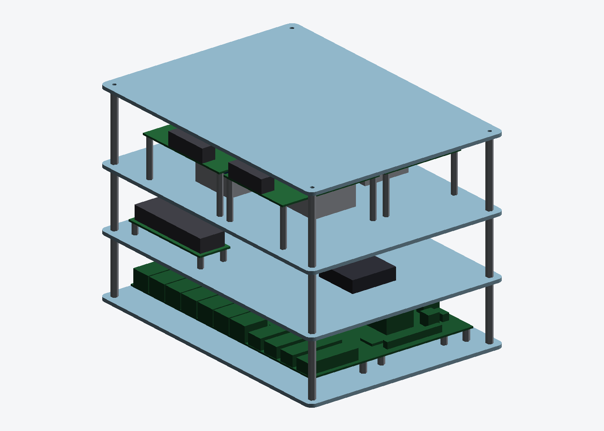
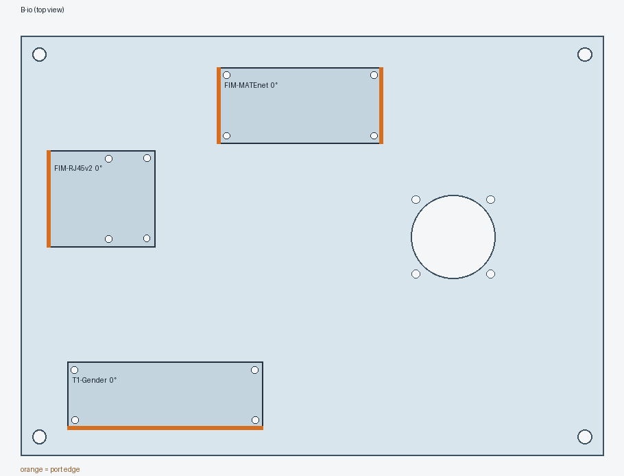
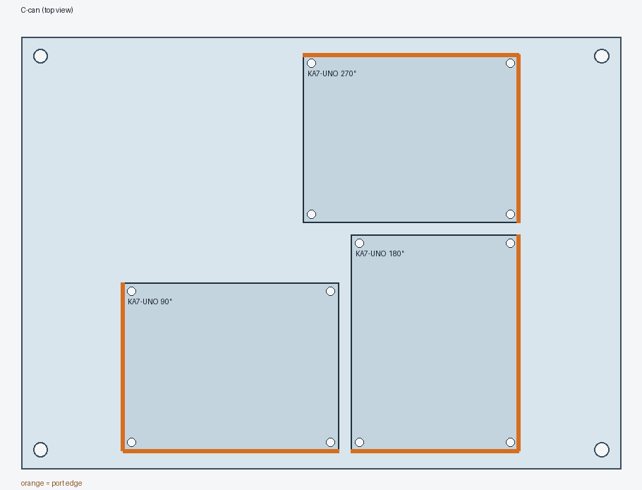
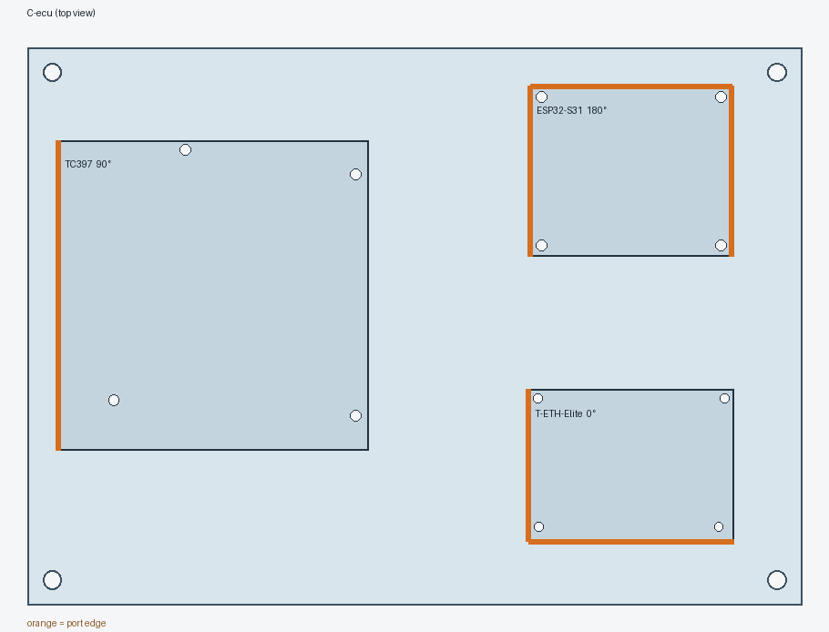

# Bench v2: three stacks, a LAN9692 at the base of each

v1 ([`../acrylic-frame/`](../acrylic-frame/)) put everything on a single switch.
v2 is the three-switch ring. Each LAN9692 is the base of its own stack. Every
plate above the base has the same 250 × 180 × 3 mm outline and the same four
corner columns, so any upper plate bolts onto any stack. What a stack carries
depends on which plates you put on it, not on anything the cutter does.



| Plate | Order | Carries |
|---|---:|---|
| `A-base` | 3 | LAN9692 on 8 standoffs, identical to v1 plate A |
| `B-io` | 3 | the 9692's 40 mm fan on top over the bore, FIM-RJ45 v2, FIM-MATEnet, T1 connector gender |
| `C-can` | 2 | KA7-UNO CAN boards: four mount sets, fit up to four |
| `C-ecu` | 1 | TC397, T-ETH-Elite, ESP32-S31 |
| `D-top` | 3 | plain guard |

| Stack | Plates |
|---|---|
| FR | A · B-io · C-can · D |
| FL | A · B-io · C-can · D |
| REAR | A · B-io · C-ecu · D (the ACU sits here, as it does on the vehicle) |

That is 12 plates in total, all cut from one stock. The order file is
[`bench-v2-dxf.zip`](bench-v2-dxf.zip) (one DXF per plate type, quantities as
above). As in v1, order the DXF and never the STL.

## Looking at it

* `stl/bench_v2.stl`: all three stacks side by side (FL, FR, REAR)
* `stl/stack_*.stl`: one stack each
* `stl/plate_*.stl`: each plate on its own

GitHub renders any of these in 3D when you click them.

| B-io | C-can | C-ecu |
|---|---|---|
|  |  |  |

Orange marks port edges. Every connector edge reaches a rim, except two that
face the TC397 across 52 mm of open plate on `C-ecu`.

## The CAN board: right way up, on tall standoffs

The AC7200 SoM hangs 7.22 mm under the carrier, and the 20 mm heatsink hangs
under that. Three ways to deal with it:

* **Flip the board.** The heatsink then faces up, but the screw terminals face
  down onto the plate.
* **Cut a window.** The heatsink drops into the layer below, so that plate's
  layout would depend on this one's. That breaks the rule that any plate fits
  any stack.
* **Tall standoffs (chosen).** On M3 × 35 mm the heatsink ends 7.8 mm above the
  plate, in open air on all sides. Every terminal stays on top, and the layer
  gap to plate D becomes 60 mm (10.75 mm left over the carrier's parts).

The fan on each stack stays over the switch die. It is sized and bored for U1,
so do not take it off to cool the CAN boards. If the FPGAs need forced air, buy
another NF-A4x10 (12 V, 0.05 A) for the same Y splitter.

## New boards, and what changed

Both new boards come from their own KiCad PCBs: the outline from Edge.Cuts, the
holes from the `MountingHole` footprints. The KiCad sources are kept in
`../board-data/` and are not committed.

* **FIM-RJ45 v2 (260910) has a different footprint from the v1 RJ45 module:**
  45.40 × 41.75 mm against 69.585 × 34.000. v1 plate B does not fit it. Its four
  mounting holes are not a rectangle: the right-hand pair is 0.2 and 0.4 mm off
  square, and they are cut exactly where KiCad puts them.
* **T1 connector gender:** 84.0 × 28.4 mm. It has three mounting holes, plus the
  Ø2.5 peg of J3 in the fourth corner. All three TE connectors face one long edge.

## Numbers that are still assumptions

* T1 gender connector height (12 mm). It only affects the B → C clearance,
  which has 14.9 mm to spare.
* TC397 part height (20 mm), carried over from v1.
* Heatsink footprint: modelled as 40 × 40, centred on the SoM. Only its height
  matters to the plates.

## Regenerating

```bash
python3 make_v2.py          # checks, DXF, zip, STL, PNG
python3 make_v2.py --no-png # skip the slow renders
```

The checks reuse v1's layout checker (`../acrylic-frame/variants.py`). It covers
overlap, the acrylic web between holes, rim and column clearance, the fan bore,
and whether each port edge reaches a rim. On top of that, v2 adds the vertical
clearances for each layer.
