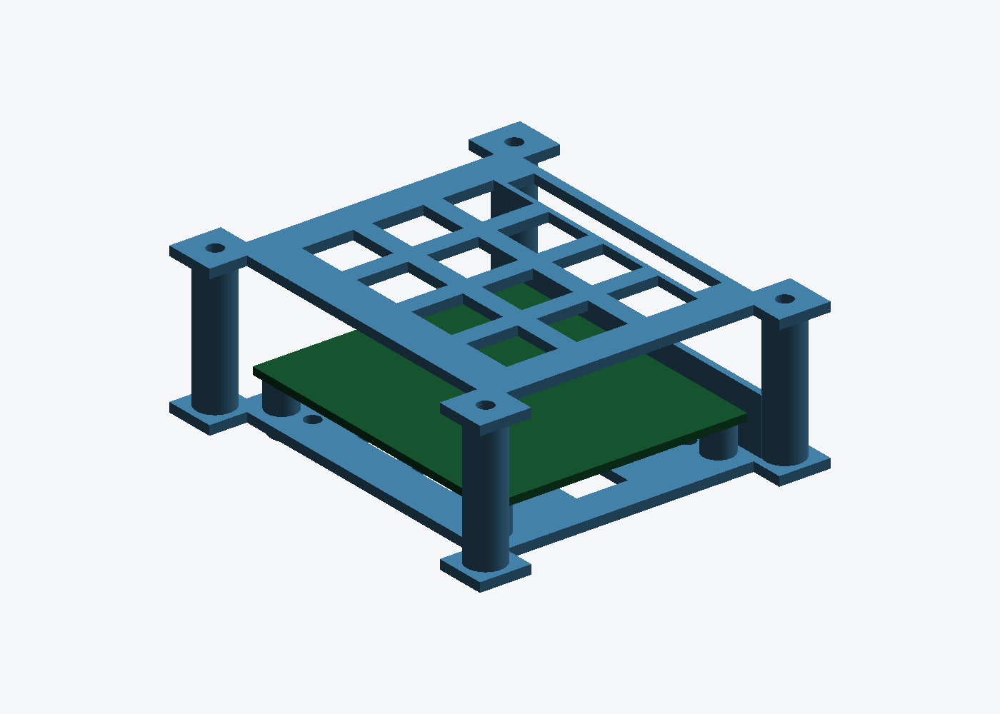

# ESP32-S31-Function-CoreBoard-1 case

Tray + vented lid for Espressif's ESP32-S31 CoreBoard-1.

> **Not the board on this bench.** This was drawn before the ESP32 board here
> was identified as the LilyGo T-ETH-Elite ESP32-S3, which is a different board
> with a different footprint — see [`../lilygo-t-eth-elite-case/`](../lilygo-t-eth-elite-case/).
> The design below is sourced from Espressif's own drawing and is correct for
> the S31 CoreBoard; it just has no board here to hold.



| | |
|---|---|
| Tray | 85.0 × 75.0 × 31.6 mm, 15.0 cm³ |
| Lid | 85.0 × 75.0 × 2.0 mm, 5.7 cm³ |
| Assembled height | 31.6 mm |
| Fasteners | 4 × M3 × 6 (board), 4 × M3 × 10 (lid) |

## Where the numbers come from

Espressif publishes the same drawing as a DXF and a PDF, and **the PDF carries
more**. An earlier version of this case was built from the DXF alone and
reported the mounting holes and port positions as unpublished. They are
published — in the PDF.

<https://dl.espressif.com/schematics/esp32-s31-function-coreboard-1-dimensions.pdf>

| | Value | How |
|---|---|---|
| Outline | **65.000 × 55.000 mm**, corner R3.5 | stated; DXF straight edges run 3.5…61.5 / 3.5…51.5 |
| Mounting holes | **4 on a 58.00 × 48.00 rectangle** → (3.5, 3.5), (61.5, 3.5), (3.5, 51.5), (61.5, 51.5) | dimensioned in the PDF; measured at 600 dpi the X and Y scales agree to **0.01%**, and the holes sit 3.25–3.41 mm in from the edges, i.e. on the R3.5 corner arc centres |
| Hole pads | Ø5.1 mm | measured |
| Header | 2×20, pin 1 (8.370, 53.270), 2.54 pitch | DXF dimension callout |
| Ports | y=0 two USB-C (UART, DBG) · x=65 1GbE RJ45 + USB-A · x=0 speaker · y=55 nothing | silkscreen labels in the PDF |

Still assumed: `PCB_T = 1.6` and `INNER_H = 20` above the board.

## Design

Three of the four edges carry connectors, so **only the y = 55 edge gets a
wall** — the previous version walled off x = 65, which is where the RJ45 and the
USB-A are. The board screws down onto four real standoffs instead of resting on
a shelf, and the lid no longer needs hold-down pads.

The lid keeps its slot for the 40-pin header, and the tray floor keeps the
4 × Ø3.4 deck holes on the 45 mm square, matching the bosses on the printed
LAN9692 box lid. It does **not** match the acrylic frame's plate B, whose deck
went to 35 × 45 to clear the T-ETH-Elite's mount slots — set
`DECK_HOLES['pitch']` accordingly if that is where this tray has to go.

## Regenerating

```bash
pip3 install --break-system-packages trimesh manifold3d
python3 esp32_s31_case.py     # -> esp32_s31_tray.stl, esp32_s31_lid.stl
```

Constants at the top of the script: `INNER_H` sets the clearance above the
board (20 mm), `STANDOFF_H` the space beneath it (6 mm), `HDR_*` the header
slot.

## Printing

MJF PA12 or FDM PETG/ABS, both parts flat, no supports. At 27 cm³ for the pair
this is cheap in either process. 0.2 mm layers and ≥4 perimeters in FDM so the
corner posts hold an M3 thread.
