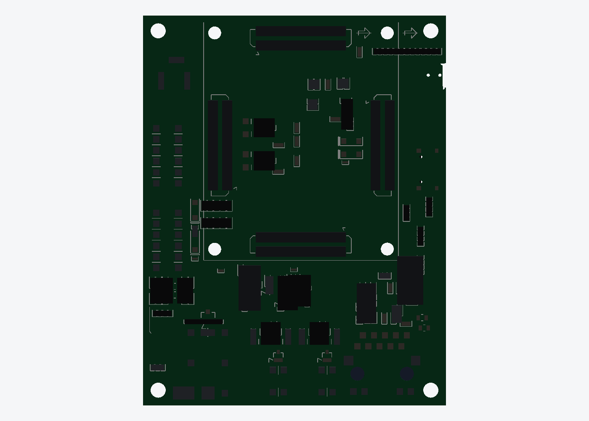
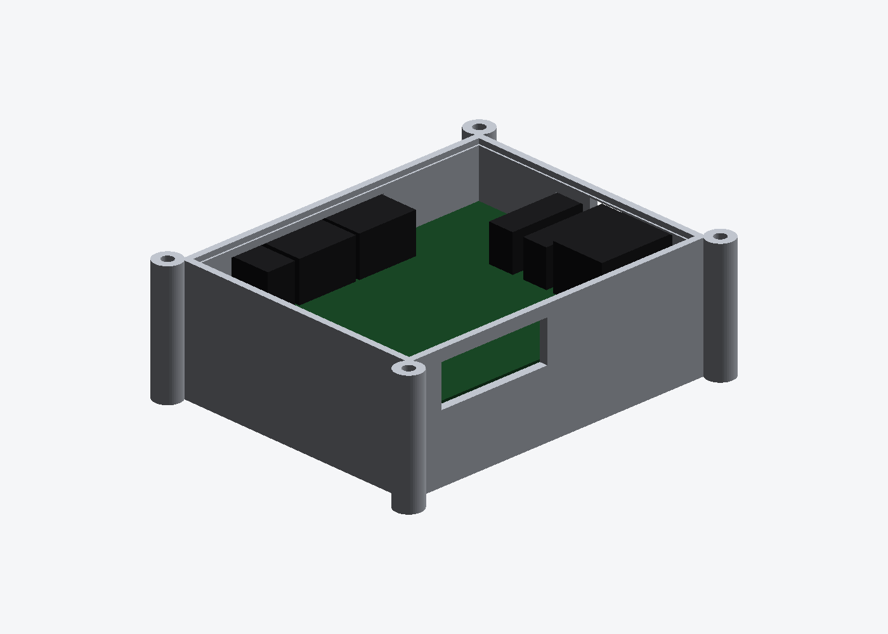
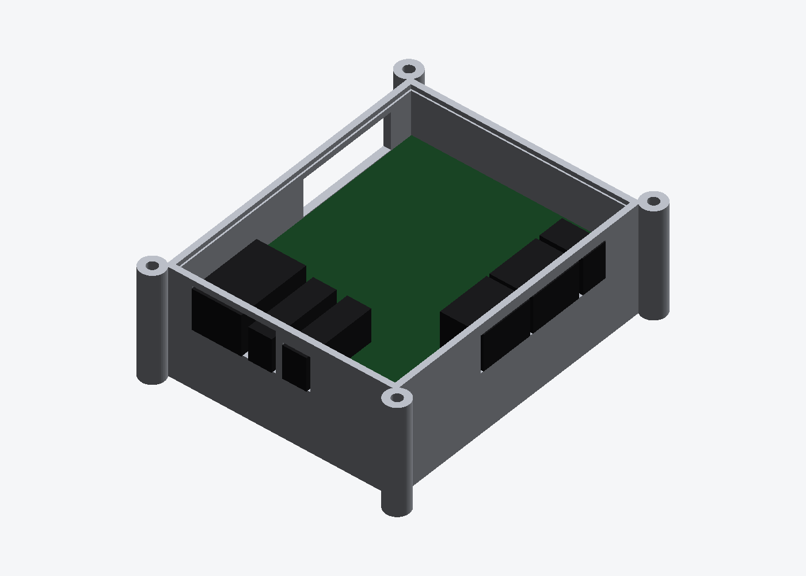
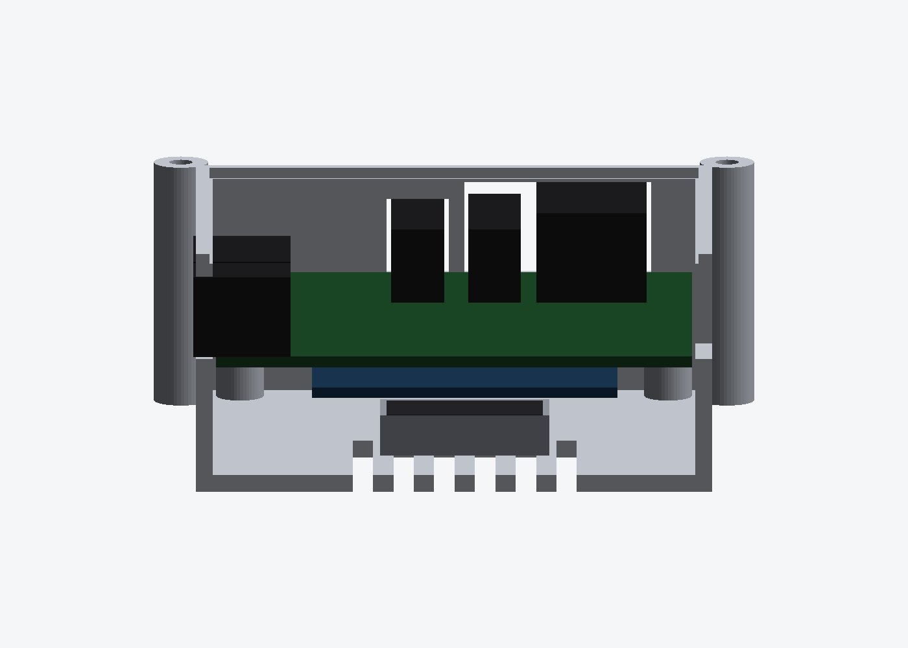

# KETI KA7_UNO REV1

A model of the CAN board, built from its own fabrication set. Not an enclosure —
this exists so [`../acrylic-frame/`](../acrylic-frame/) can show the real board on
plate C instead of a featureless block, and so the plate's holes come from fab
data rather than a ruler.




## What the board is

Six layers, **70.000 × 90.000 mm**, dated 2026-08-27 on its own silkscreen. From
the BOM and the silkscreen it is a multi-protocol automotive node:

| | |
|---|---|
| CAN FD | 2 × `TCAN1044V` — `CAN0`, `CAN1`, each with `Term#1` / `Term#2` jumpers |
| 10BASE-T1S | `LAN8671C` and `TJA1410A` — `T1S0`, `T1S1`, each with a NodeID selector and an `end / drop` jumper |
| Ethernet | `LAN8830`, `LAN8870` — `ETH0` with LINK / LED2 / LED3 |
| LIN | `LIN0`, `LIN1`, each with GND / BUS / 12V |
| Other | `POWER IN`, 5.0 V_VIN and 3.3 V rails, `RESET`, `TEST_LED`, `TEST_SW_IN`, an 8-way selector, L1–L4 LEDs |

The CAN, LIN and power terminals are all on the **left edge**; the two T1S pairs
are along the **top edge**. That is why the board sits where it does on plate C.

## What is exact and what is not

| | source | |
|---|---|---|
| Outline, **10 vertices including 2 arcs** | `BOARD_OUTLINE`, bulges read positionally | exact |
| 88 drilled holes, cut through at their real Ø | every `CIRCLE` on the hole layers | exact |
| 4 × Ø3.5 mount holes, 3.5 mm in from each edge | `ThruHoleNonPlated.ncd` **and** `MOUNTING_HOLES_LAYER_TOP` — two files agreeing | exact |
| 928 pads on top, **824 underneath** | the `PART_PADS_*` and `PART_HOLES_*` layers of both sheets | exact |
| 1436 silkscreen segments on top, **593 underneath** | `SILKSCREEN_OUTLINES_TOP` and `_BTM` | exact |
| 219 components on top, **138 underneath** | clustered from the pads | positions exact |
| 77 silkscreen labels | the `TEXT` entities | exact |
| Component **heights** | — | **guessed** |

**It is populated on both sides**, 824 pads and 138 components down there against
928 and 219 up here, so the model carries both. A board with a bare green back is
an incomplete model whichever face you happen to be looking at. Through-hole parts
are counted once, on top: their pads appear on both faces but the body sits on
one.

**Which face is which** is settled by the fab set rather than assumed. The
through-hole coordinates in `TOP.dxf` and `BOT.dxf` are **identical**, not
mirrored about x = 35, so both sheets are drawn in the same frame — as seen from
the top — and `L1-COMP` is the component side. The silkscreen `TEXT` entities
carry no group-71 mirror flag either.

**It is not a rectangle.** The outline carries a 0.75 × 5.6 mm notch in the right
edge at y 11.0…16.6, with a 90° rounded corner at each end of it. A DXF bulge is
`tan(θ/4)` for the segment *leaving* its vertex, so it has to be read
positionally — pulling all the group-42 values out in one sweep loses which
vertex owns which, and exactly two of these ten do.

Copper and silkscreen are clipped to that outline by **both endpoints**, not the
midpoint: the fab drawing's leader lines run from a component out to its
reference text in the margin, and plenty of them still have a midpoint over the
board. Clipping on midpoints left 73 strokes hanging off the edges and the model
measured 73.8 × 93.7 instead of 70 × 90.

There is no pick-and-place file in the Gerber set and no height data anywhere in
a Gerber set, so a component is recovered as a cluster of pads and its height is
inferred. What does most of that work is one bit: **does the cluster contain a
through-hole pad**. A through-hole part on this board is a connector, a terminal
block or a header, and those are the tall things — SMD passives and ICs have no
holes at all. Everything else falls back to area and pad count, which is what
separates an 0402 from a QFN.

Judging by size and edge-proximity instead, as the first version did, found
**2 connectors out of 206** while the silkscreen was naming CAN0, CAN1, LIN0,
LIN1, both T1S pairs, POWER IN and two NodeID selectors. They came out 1.2 mm
tall and the same colour as the ICs, and vanished into the board.

The two kinds of pad also want different clustering gaps:

| | gap | why |
|---|---|---|
| SMD | 0.9 mm | 0.5 splits an 0402's two pads into two "components"; 1.3 starts fusing neighbouring ICs |
| through-hole | 4.5 mm | a 2.54 mm header pitch with 1.5 mm pads leaves 1.04 mm between pins, and a screw terminal's two rows sit 5.08 mm apart. At 0.9 every single pin was its own component — 78 of them |

That yields **13 through-hole parts**, and they line up with the silkscreen: the
38.8 × 14.1 mm T1S terminal bank across the top, the CAN and LIN terminal blocks
down the left edge, the CAN termination jumper block, and the NodeID selectors.

The tallest part therefore comes out at **12.7 mm** over the board, and
`../acrylic-frame/assembly.py` checks that against plate D rather than assuming
it: there is 15.4 mm of room, so the guess would have to be out by a fifth to
matter.

What hangs below is **not** the 3.0 mm of bottom-side SMD this model sees. See
below.

## It is a carrier, and the FPGA module hangs underneath

The Gerber has four pad strips of 2.30 × 0.25 mm on 0.5 mm pitch, 80 pads each,
320 in all — and they are in `S-PASTE.gdo`, the **solder side**. They are the
Panasonic AXK5-series sockets that the **ALINX AC7200** Artix-7 module plugs
into. So the module does not sit on the board, it hangs under it, and the
carrier's top surface is ports only.

All four strips sit 3.70 mm in from their nearest module edge, which is what
fixes the module's position without guessing:

| | |
|---|---|
| AC7200 | XC7A200T-2FGG484I, 1 GB DDR3, **45.0 × 55.0 × 1.6 mm** |
| where | carrier x 14.08…59.08, y 1.48…56.48 |
| gap | **3.0 mm** — the mated height of AXK580137YG / AXK680137YG |
| below the carrier | 3.0 + 1.6 module PCB + 2.62 FGG484 package = **7.22 mm** |
| its supports | the carrier's four Ø3.0 plated holes, 2.5 mm in from each module corner |

The FGG484 package height is out of ALINX's own `AC7200.3.0.stp`, which also
settles the orientation: the FPGA and the DDR3 are on the module's **other**
face, so mounted this way the FPGA points **down, away from the carrier**, with
nothing over it. That is the only open face in the whole stack, and it is where
any cooling has to go.

It is also why the frame's plate C now uses **M3 × 20** standoffs. At the 8 mm
it used to have, the FPGA package sat 0.78 mm off the acrylic.

## The printed case

```bash
python3 case.py     # -> ka7_case_base.stl, ka7_case_lid.stl, renders, fit checks
```







Base and lid, **88.4 × 108.4 × 38.3 mm**, 47.5 + 23.2 cm³. The section is cut at
y = 30 through the CAN terminal block: floor vents at the bottom, then the
module, then the carrier, then the port band.

Every opening is placed from the **C-ASSY** assembly layer — the component-side
body outlines the fab drawing already carries — not from pad extents, which stop
short of a connector's shell:

| Port | Edge | Body, board-local | Height |
|---|---|---|---|
| `ETH0` RJ45 | back | x 47.10…63.40, 21.5 deep, 3.9 mm proud of the edge | 13.5 mm |
| `CN1` T1S0 | back | x 25.70…33.60 | assumed |
| `CN2` T1S1 | back | x 37.10…44.80 | assumed |
| `J7` LIN0 / LIN1 | left | y 41.00…59.20, 2.6 mm proud | assumed |
| `J3` CAN0 / CAN1 | left | y 21.70…39.90, 2.6 mm proud | assumed |
| `J1` POWER IN | left | y 11.50…20.30, 3.4 mm proud | assumed |
| right edge | right | y 8.00…41.00, over the outline notch | assumed |

The RJ45 is the one height that is not a guess: its two Ø3.25 board locks at
(49.535, 82.7) and (60.965, 82.7) are 11.43 mm apart and its body is 16.3 × 21.5,
which is a standard 1 × 1 magjack, 13.5 mm tall. **Every other height is
assumed** — a Gerber set contains no height data at all — and they are all one
column of the `PORTS` table at the top of `case.py`, one edit each. The printout
flags every assumed one on every run.

Three of the left-edge connectors are about a millimetre apart, so a wall rib
between them would be thinner than a printed wall can be. `windows()` merges any
opening whose rib would fall under 2 mm, which turns seven connectors into four
openings and says so in the printout.

`case.py` will not write an STL it has not checked. It probes the finished mesh
at 25 points, plus a 60-sample sweep across the floor vents — inside each opening and in the wall right under it, in the module
cavity, in the floor vents, in a post bore and beside it, in a pillar bore and
beside it, in the lid lip and in the rebate it drops into — and refuses to
export if any of them comes back the wrong way round. `check_stls.py` caught the
first version: 3 bodies, because differencing a concatenated cutter left two
inverted shells inside the walls. Boolean per-solid fixed it.

### How it bolts up

Four M3 run the full height of the case through the corner pillars: lid, pillar,
then either an M3 nut in the hex pocket under the pillar, or straight into an
F/F standoff on plate C. The board itself sits on four posts inside, on its own
63 × 83 pattern, with M3 into the post bores.

The pillars are on an **80.4 × 100.4** pattern, which is *not* plate C's 63 × 83
— a case that wraps the board cannot bolt through the board's own holes. Plate C
as cut today mounts the bare boards; using the case means four new holes per
board in plate C. Nothing in this folder changes that file.

## Files

```bash
python3 extract_ka7.py TOP.dxf   # -> ka7_uno_rev1.json   (run once, needs the fab set)
python3 ka7_mock.py              # -> ka7_uno_rev1.stl + four renders (JSON only)
```

`build(detail=False)` drops the copper and the silkscreen and leaves the slab and
the component bodies — 57,564 faces down to about 4,500. That is what a preview
of the whole frame wants, where a board at ten times the fidelity of its
neighbours reads as a mistake rather than as detail.

Colour lives in the renders and in the [web viewer](../docs/index.html), not in
the STL — STL has no notion of it.

The fabrication set is not in this repo — it is KETI's, it is 900 kB of Gerber,
and `ka7_uno_rev1.json` carries everything the model needs. `ka7_uno_rev1.stl` is
a preview, not something to print or cut, so `check_stls.py` skips it.
