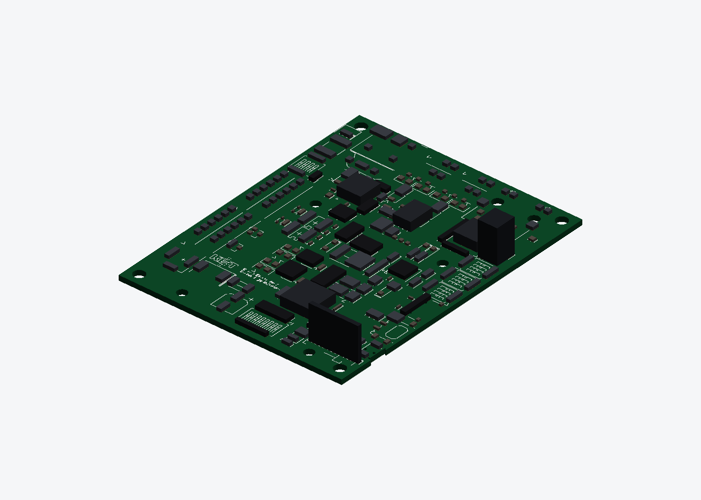
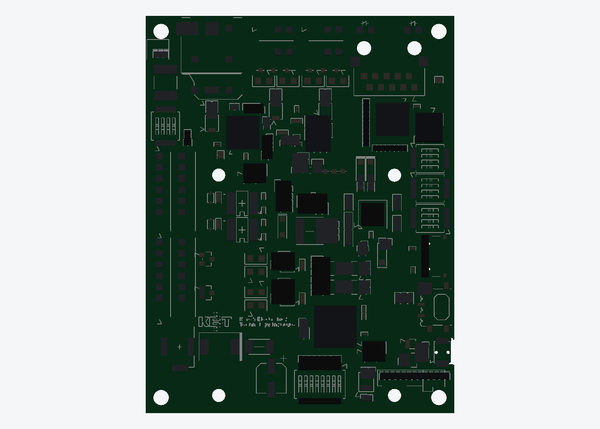

# KETI KA7_UNO REV1

A model of the CAN board, built from its own fabrication set. Not an enclosure —
this exists so [`../acrylic-frame/`](../acrylic-frame/) can show the real board on
plate C instead of a featureless block, and so the plate's holes come from fab
data rather than a ruler.





## What the board is

Six layers, **70.000 × 90.000 mm**, dated 2026-08-27 on its own silkscreen. From
the BOM and the silkscreen it is a multi-protocol automotive node:

| | |
|---|---|
| CAN FD | 2 × `TCAN1044V` — `CAN0`, `CAN1`, each with `Term#1` / `Term#2` jumpers |
| 10BASE-T1S | `LAN8671C` and `TJA1410A` — `T1S0`, `T1S1`, each with a NodeID selector and an `end / drop` jumper |
| Ethernet | `LAN8830`, `LAN8870` — `ETH0` with LINK / LED2 / LED3 |
| LIN | `LIN0`, `LIN1`, each with GND / BUS / 12V |
| Other | `POWER IN`, 5.0 V_VIN and 3.3 V rails, `RESET`, `TEST_LED`, `TEST_SW_IN`, an 8-way selector, L1–L4 LEDs |

The CAN, LIN and power terminals are all on the **left edge**; the two T1S pairs
are along the **top edge**. That is why the board sits where it does on plate C.

## What is exact and what is not

| | source | |
|---|---|---|
| Outline, **10 vertices including 2 arcs** | `BOARD_OUTLINE`, bulges read positionally | exact |
| 88 drilled holes, cut through at their real Ø | every `CIRCLE` on the hole layers | exact |
| 4 × Ø3.5 mount holes, 3.5 mm in from each edge | `ThruHoleNonPlated.ncd` **and** `MOUNTING_HOLES_LAYER_TOP` — two files agreeing | exact |
| 928 pads | `PART_PADS_SMD_TOP`, `PART_PADS_LAYER_TOP`, `PART_HOLES_LAYER_TOP` | exact |
| 1436 silkscreen segments | `SILKSCREEN_OUTLINES_TOP` | exact |
| 206 component positions | clustered from the pads | positions exact |
| 77 silkscreen labels | the `TEXT` entities | exact |
| Component **heights** | — | **guessed** |

**It is not a rectangle.** The outline carries a 0.75 × 5.6 mm notch in the right
edge at y 11.0…16.6, with a 90° rounded corner at each end of it. A DXF bulge is
`tan(θ/4)` for the segment *leaving* its vertex, so it has to be read
positionally — pulling all the group-42 values out in one sweep loses which
vertex owns which, and exactly two of these ten do.

Copper and silkscreen are clipped to that outline by **both endpoints**, not the
midpoint: the fab drawing's leader lines run from a component out to its
reference text in the margin, and plenty of them still have a midpoint over the
board. Clipping on midpoints left 73 strokes hanging off the edges and the model
measured 73.8 × 93.7 instead of 70 × 90.

There is no pick-and-place file in the Gerber set and no height data anywhere in
a Gerber set, so a component is recovered as a cluster of pads and its height is
inferred from its own footprint: an edge part with real area is a connector at
11 mm, otherwise 0.6–3.0 mm by area and pad count. `extract_ka7.py` documents the
thresholds. 0.9 mm is the clustering gap — 0.5 splits an 0402's two pads into two
"components", 1.3 starts fusing neighbouring ICs.

The tallest part therefore comes out at **12.6 mm** over the plate, and
`../acrylic-frame/assembly.py` checks that against plate D rather than assuming
it: there is 24.4 mm of room, so the guess would have to be out by nearly double
to matter.

## Files

```bash
python3 extract_ka7.py TOP.dxf   # -> ka7_uno_rev1.json   (run once, needs the fab set)
python3 ka7_mock.py              # -> ka7_uno_rev1.stl + four renders (JSON only)
```

`build(detail=False)` drops the copper and the silkscreen and leaves the slab and
the component bodies — 38,748 faces down to about 2,900. That is what a preview
of the whole frame wants, where a board at ten times the fidelity of its
neighbours reads as a mistake rather than as detail.

Colour lives in the renders and in the [web viewer](../docs/index.html), not in
the STL — STL has no notion of it.

The fabrication set is not in this repo — it is KETI's, it is 900 kB of Gerber,
and `ka7_uno_rev1.json` carries everything the model needs. `ka7_uno_rev1.stl` is
a preview, not something to print or cut, so `check_stls.py` skips it.
