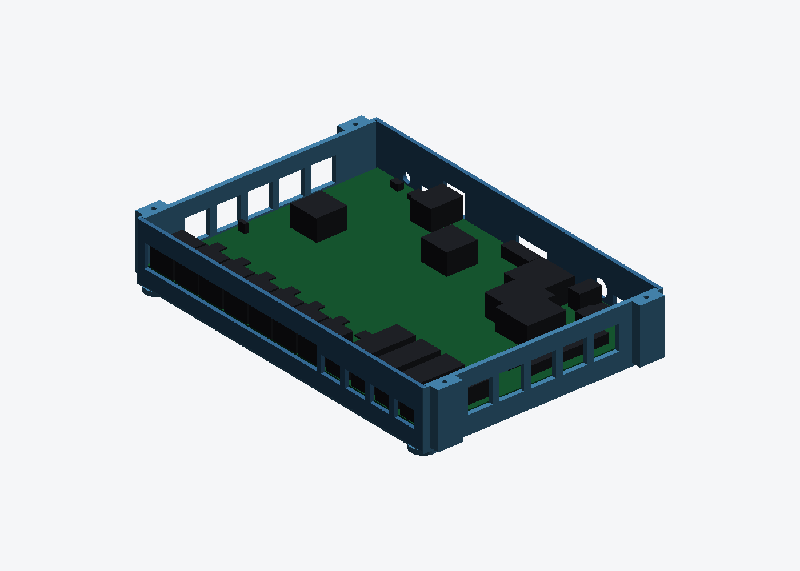
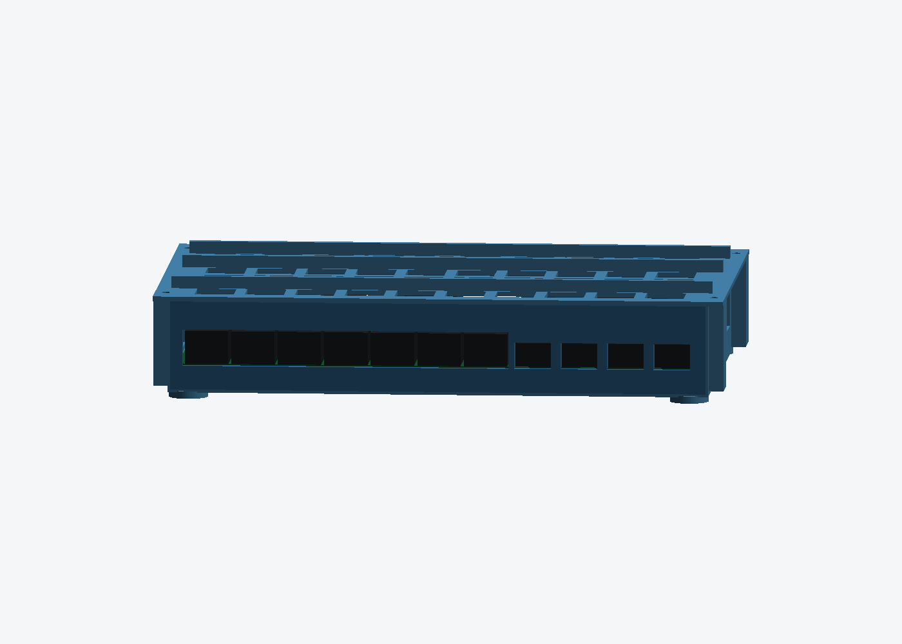
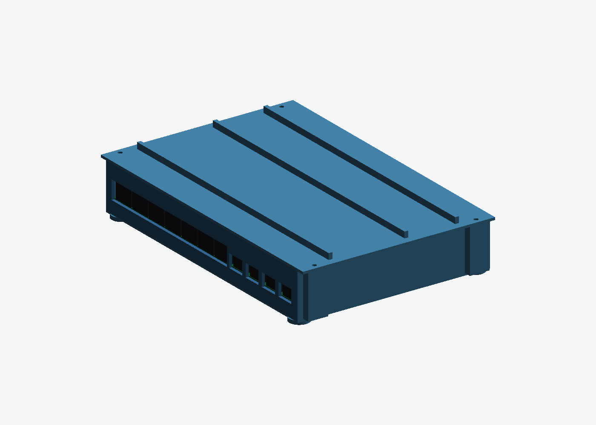

# EVB-LAN9692-LM enclosure

Enclosures for the Microchip EVB-LAN9692-LM automotive 12-port TSN evaluation
board (EV09P11A). No off-the-shelf model for this board exists, so everything is
generated from Microchip's released manufacturing data — Gerbers + Excellon
(`04-12092-R1`) and the pick-and-place file (`02-01022-R1`), both 30 Apr 2026.

Three styles, same board data:

| | open tray | closed box, vented | closed box, sealed |
|---|---|---|---|
| Build | `lan9692_case.py` | `lan9692_box.py` | `lan9692_box.py --solid` |
| Parts | tray + lid | tray + 2 panels + lid | tray + 2 panels + lid |
| Ends | open, no cut-outs to get wrong | **matched port windows** | **matched port windows** |
| Elsewhere | vent grid | vent grid in floor, walls, lid | **nothing but the ports** |
| Outside | 236.4 × 172.9 × 39.5 | 233.8 × 155.7 × 39.5 | 233.8 × 155.7 × 39.5 mm |
| Volume | 74.3 + 44.2 = **118.5 cm³** | 86.7 + 12.8 + 17.2 + 46.8 = **163.5 cm³** | 124.6 + 12.8 + 17.2 + 82.7 = **237.2 cm³** |
| Fasteners | 8 × M3 × 8, 4 × M3 × 10 | same | same |



Vented box, lid off. The board is `board_mock.py` — the real PCB outline with a
block per part at its pick-and-place position — so the picture doubles as proof
that the windows line up:




### On sealing it completely

The sealed variant is what `--solid` gives you: solid floor, solid walls, solid
ribbed lid, and the port windows as the only openings. Worth knowing before
ordering it — the board's own power tree budgets **12 V @ 4.1 A, under 50 W**,
and a sealed plastic box of this size has roughly 0.14 m² of outside surface to
shed it through. At natural convection that is tens of degrees of internal rise
before the air even reaches the SFP cages and the seven PHYs, against a board
rated to +85 °C *"case and airflow dependent"* (user's guide §6.1). It is fine
for a lightly loaded bench setup and for looks; the vented variant is the one to
run at load. Same parts, same fit — only the grids differ, so you can order the
sealed lid later and swap it.

## Closed box — port windows

Connector X/Y is exact: it comes from the pick-and-place file, which also gives
the manufacturer part number of every connector. Connector *heights* are in no
released file, so those come from datasheets and standards. **The end panels are
separate parts for exactly that reason** — a wrong window is a 13–18 cm³ reprint,
not a new box. They slide into channels in the side walls and the lid traps
them; no extra screws.


| Port | Part | Window | z above PCB | Source |
|---|---|---|---|---|
| 7 × MATEnet `J12`,`J11A-F` | TE 9-2304372-9 | one slot, x 2.06…135.61 | −0.5…14.5 | datasheet: 17.75 W × 13.5 H |
| 4 × SFP+ `X1A-D` | U77-A111X cage | 15.0 × 10.8 at x 145.6/164.6/183.6/202.6 | −0.4…10.4 | SFP MSA panel cut-out |
| RJ45 `J33` | L829-1J1T-43 | 17.0 × 15.0 at x 58.803 | −0.5…14.5 | 8P8C standard body |
| USB-C `J30` | USB4105 | 10.5 × 5.0 at x 37.762, outer relief | −0.6…4.4 | receptacle 8.94 × 3.16 |
| OCuLink `J21` | AMP G14A42121B12HR | 24.0 × 9.0 at x 118.305 | −0.5…8.5 | **estimate** |
| DC jack `J23` | PJ-002BH | Ø11.0 at x 171.283 | centre 6.5 | **estimated** axis height |
| Power switch `SW3` | ESW-500SSP1S1M6QEA | 14.0 × 7.5 at x 188.110 | −0.5…7.0 | **estimate** |
| Reset `SW2` | 1825027-5 | Ø6.0 at x 21.844 | centre 3.5 | **estimate** |

The MATEnet row has to be one continuous slot: the bodies are 17.75 mm wide on a
19.05 mm pitch, so individual windows would leave 0.3 mm of panel between them.
The USB-C sits ~1.2 mm inside the board edge, so its window gets a relief pocket
on the outside face to thin the panel to 1.0 mm there and let a plug seat.

| | |
|---|---|
| Open tray | 236.4 × 172.9 × 40 mm, 74.3 cm³ + lid 44.2 cm³ |
| Assembled height | 39.5 mm |
| Fasteners | 8 × M3 × 8 (PCB), 4 × M3 × 10 (lid) |

## Design

Both long edges of the board are solid connectors — 7× MATEnet and 4× SFP+ on
the front, RJ45 / USB-C / 12 V jack / 2× SMA / OCuLink on the rear — so **the
tray is deliberately open at both ends**. Nothing has to line up with a
connector, the cages and PHYs get unobstructed airflow, and the part costs
roughly half of what a closed box would.

The board is carried by 8 screw standoffs under its mounting holes plus a
1.6 mm ledge running the full length of both side walls, so the SFP end cannot
droop when a transceiver is plugged in. The side walls stand 4.5 mm proud of
the PCB top face to protect the board edges. The lid is optional and screws to
four corner posts that sit diagonally outboard of the PCB corners.


## Where the dimensions come from

`extract_board_data.py` reads them out of the released fab data. Download the
Gerber set from the [EV09P11A page](https://www.microchip.com/en-us/development-tool/EV09P11A)
(Gerbers, 30 Apr 2026), unzip, and run it:

```
board outline      213.360 x 149.860 mm   (corners 0.000,0.000 .. 213.360,149.860)
                   = 8.400 x 5.900 in
mounting holes     8 x Ø3.048 mm
  corner inset 3.556 mm = 0.140 in
bottom-side pads   1734 apertures inside the outline
  nearest to left edge  5.60 mm
  nearest to right edge 2.75 mm
  nearest to any mounting hole centre 5.42 mm (Ø7.0 boss needs 3.5) -> OK
  RAIL_IN = 1.6: 0 pad(s) under the rail -> OK
  RAIL_IN = 3.0: 2 pad(s) under the rail -> too wide
```

* **Outline 213.360 × 149.860 mm** from the BOARD (`.GM2`) layer — exactly
  8.400 × 5.900 in. The user's guide rounds this to "214 x 150 mm", so the
  drawing-derived numbers this model used to carry were scaled 0.3% too large.
  That layer also holds the fab drawing frame, so the outline is taken as the
  tightest rectangle of real outline lines that still encloses the drill
  pattern, not as the layer extent.
* **8 × Ø3.048 mm (0.120 in) PTH** mounting holes — tool T23 in the drill
  report, straight out of `04-12092-R1-RoundHoles.TXT`:

  | # | X (mm) | Y (mm) |  | # | X (mm) | Y (mm) |
  |---|---|---|---|---|---|---|
  | 1 | 3.556 | 146.304 | | 5 | 205.187 | 71.330 |
  | 2 | 101.600 | 146.304 | | 6 | 208.788 | 51.816 |
  | 3 | 209.804 | 146.304 | | 7 | 133.350 | 51.562 |
  | 4 | 205.187 | 129.330 | | 8 | 3.556 | 24.892 |

* **Bottom-side keepouts** from the bottom paste (`.GBP`) layer, which is where
  bottom-side parts actually sit. It clears every standoff by 5.42 mm and has no
  aperture within 1.6 mm of either side edge — so the support rails are safe at
  1.6 mm and would clip two pads at 3.0 mm. The assembly layers (`.GM10/.GM11`)
  also contain designator text and hole symbols and are useless as a keepout
  source.
* **PCB thickness 1.535 mm**, 4 layers — §A.2 of the user's guide.

### Why `INNER_H` is 26 mm, and what it should be

This is the only number in the repo that is not from a source, so here is
exactly what it rests on. `board_mock.py` lists every significant part with the
height it was given:

| Part | Height above PCB | Source |
|---|---|---|
| MATEnet `J11/J12` ×7 | 13.5 mm | TE 9-2304372-9 |
| RJ45 `J33` | 13.5 mm | 8P8C with magnetics |
| DC jack `J23` | 11.0 mm | PJ-002BH body |
| Alu cap `C324` | 10.2 mm | F case |
| SFP+ cage ×4 | 9.8 mm | SFP MSA |
| Expansion header `J4` (2×20) | **5.84 mm** | `5.84MH` in the board's own BOM line |
| **DC-DC modules ×5** | **?** | `MOD_DC-DC_ADM00987` ×3 + `MOD_DC-DC_PM-LV2` ×2 |

So **the tallest part with a real source is 13.5 mm**, and the expansion header
— which the board photo made look like the tall one — is actually the shortest
of the candidates at 5.84 mm. The whole 26 mm exists for one reason: the five
DC-DC daughter modules. They are PCB assemblies (`ADM00987` is Microchip's
MCP19035 8 A power module, mounted on Samtec TMM 2 mm headers) and no released
document gives their stack height. They are the red blocks in Figure 4-2.

Measure one of them and `INNER_H` can drop to about *height + 4 mm*:

* if they are ≤ 14 mm → `INNER_H = 18`, box 8 mm shorter, ~15% less material
* if they stand vertically and reach 22 mm → 26 is already correct

Nothing else moves: every port window rides on the PCB top face, and the
tallest one tops out 14.5 mm above it.

While on heights, the other direction is now settled from data rather than
guessed: the bottom side carries **365 parts, all 0402/0603 passives, TSSOP and
3.2 × 2.5 mm inductors — about 1.6 mm at worst**, so the 8 mm of underboard
space is verified clear with room to spare.

## Regenerating

```bash
pip3 install --break-system-packages trimesh manifold3d
python3 board_mock.py              # board preview + port-window clearance check
python3 assembly_preview.py        # every img/*.png with the board in place
python3 lan9692_case.py            # -> lan9692_tray.stl, lan9692_lid.stl
python3 lan9692_box.py             # -> lan9692_box_{tray,front,rear,lid}.stl
python3 lan9692_box.py --solid     # -> lan9692_boxsolid_*.stl (ports only)
python3 assembly_preview.py        # -> assembly.png
python3 render_preview.py lan9692_tray.stl tray.png --elev 28 --azim -50
```

Every dimension is a constant at the top of `lan9692_case.py`. `MAKE_LID =
False` skips the lid; `INNER_H` sets the clearance above the board; `RAIL_IN =
0` removes the side ledges if the board turns out to have bottom-side parts
within 1.6 mm of its left/right edges.

`render_preview.py` is a small software rasteriser so previews work on a
headless box with no GL stack.

## Assembly

1. Remove any rubber foot that covers a mounting hole (the board ships with
   feet, visible in Figure 4-2). Feet that clear the holes can stay — they are
   about 5 mm tall against the tray's 8 mm of underboard space.
2. Drop the board in — it lands on the eight standoffs and the two side ledges.
3. 8 × M3 × 8 thread-forming screws into the standoffs. The pilots are 2.9 mm;
   if a hole is off by a few tenths, open that pilot up to 3.2 mm.
4. Lid: 4 × M3 × 10 into the corner posts.

## Printing

FDM in ABS or PETG, both parts flat on the bed, no supports needed — every
overhang is either a through-hole or the top of a post. 0.2 mm layers, ≥4
perimeters on the tray so the standoffs and posts hold a thread. PLA works but
creeps under a warm board.

MJF PA12 also prints it as-is (min wall 1.0 mm, everything here is ≥2.0 mm) and
gives much better threads, but at 122 cm³ for the pair it is the expensive
option.

## Port-window check

`board_mock.py` measures every window in `lan9692_box.py` against the connector
that has to pass through it:

```
window                      part span            window span    x margin  z margin
MATEnet x7         2.81..  134.86 x 13.5h     2.06..  135.61 x 14.5      0.75      0.50  ok
SFP+ A           138.35..  152.85 x  9.8h   138.10..  153.10 x 10.4      0.25      0.40  ok
RJ45 J33          50.86..   66.74 x 13.5h    50.30..   67.30 x 14.5      0.56      0.50  ok
USB-C J30         33.26..   42.26 x  3.2h    32.51..   43.01 x  4.4      0.75      0.60  ok
OCuLink J21      107.31..  129.31 x  7.0h   106.31..  130.31 x  8.5      1.00      0.50  ok
switch SW3       182.11..  194.11 x  6.0h   181.11..  195.11 x  7.0      1.00      0.50  ok
DC jack J23      168.53..  174.03 x  9.2h   165.78..  176.78 x 12.0      2.75      2.75  ok
reset SW2         20.09..   23.59 x  5.2h    18.84..   24.84 x  6.5      1.25      1.25  ok
```

Two of these are compared against the feature that actually goes through the
panel rather than the whole body — the DC jack's 5.5 mm barrel and the tact
switch's plunger — because their bodies sit behind the panel. The SFP row is
checked against the 14.5 mm cage body, which is stricter than the 14.25 mm MSA
aperture that has to line up, so its 0.25 mm is pessimistic.

## What happens if the derived numbers are off

Everything load-bearing degrades gracefully, on purpose:

* **Board width tolerance** — the wall gap is 1.2 mm per side, chosen from the
  process tolerance (MJF ±0.4% = ±0.85 mm at 213 mm, FDM shrinkage similar),
  not from a nominal fit. The board is located by its screws, not the walls.
* **A screw that will not start** — the standoff top is a flat 7 mm boss, so the
  board rests on it regardless; drill that one pilot to 3.2 mm and the other
  seven hold.
* **`INNER_H` too low** — only the lid is affected, and the lid is a separate
  STL. Print the tray first, measure the real stack height, then order it.

The outline, the hole pattern and the bottom-side keepouts are now fab data
rather than estimates, so the remaining risk is concentrated in `INNER_H`, which
only the lid depends on.
