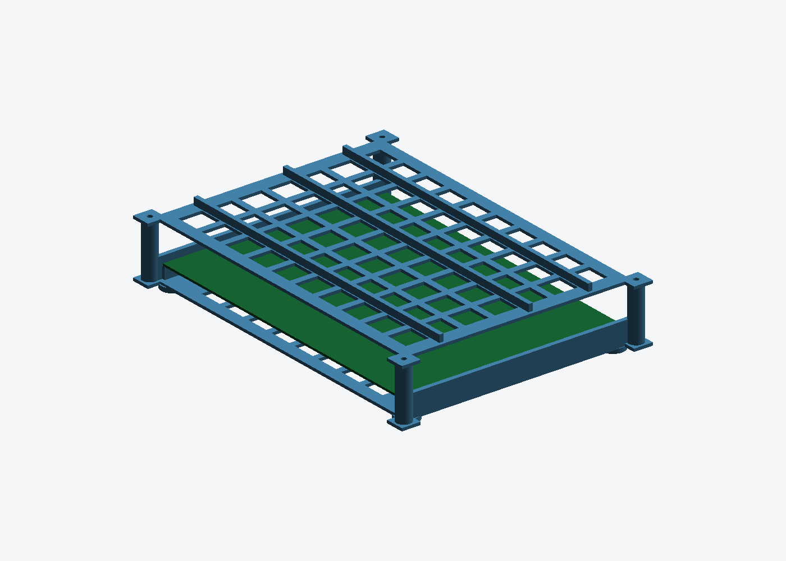
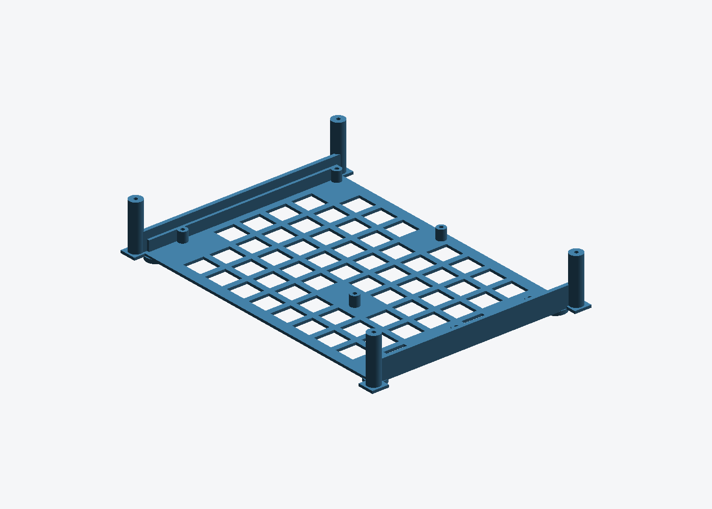

# EVB-LAN9692-LM enclosure

Open-ended tray + vented lid for the Microchip EVB-LAN9692-LM automotive
12-port TSN evaluation board (EV09P11A). No off-the-shelf model for this board
exists, so the geometry is generated from the official hardware documentation.



| | |
|---|---|
| Tray | 237 × 173 × 40 mm, 72.3 cm³ |
| Lid | 237 × 173 × 7 mm, 43.9 cm³ |
| Assembled height | 39.5 mm |
| Fasteners | 8 × M3 × 8 (PCB), 4 × M3 × 10 (lid) |

## Design

Both long edges of the board are solid connectors — 7× MATEnet and 4× SFP+ on
the front, RJ45 / USB-C / 12 V jack / 2× SMA / OCuLink on the rear — so **the
tray is deliberately open at both ends**. Nothing has to line up with a
connector, the cages and PHYs get unobstructed airflow, and the part costs
roughly half of what a closed box would.

The board is carried by 8 screw standoffs under its mounting holes plus a
1.6 mm ledge running the full length of both side walls, so the SFP end cannot
droop when a transceiver is plugged in. The side walls stand 4.5 mm proud of
the PCB top face to protect the board edges. The lid is optional and screws to
four corner posts that sit diagonally outboard of the PCB corners.



## Where the dimensions come from

Source: *EVB-LAN9692-LM Hardware User's Guide*, DS50003848B.

* **Board outline** — §A.1: "The board dimensions are 214 x 150 mm".
* **PCB thickness** — 1.535 mm, 4 layers (§A.2).
* **Mounting holes** — not tabulated anywhere in the guide, only drawn in
  Figure A-1. Recovered by rasterising page 52 at 600 dpi, fitting the PCB edge
  rectangle in the drawing and scaling it to the stated 214 × 150 mm. The two
  axes agree to 0.37%, and all 8 pads come out at 5.74 ± 0.01 mm, i.e. the same
  feature — M3 clearance holes on a 5.75 mm annular ring.

  | # | X (mm) | Y (mm) |  | # | X (mm) | Y (mm) |
  |---|---|---|---|---|---|---|
  | 1 | 3.68 | 146.45 | | 5 | 205.88 | 71.38 |
  | 2 | 102.01 | 146.45 | | 6 | 209.50 | 51.83 |
  | 3 | 210.53 | 146.46 | | 7 | 133.87 | 51.53 |
  | 4 | 205.88 | 129.44 | | 8 | 3.68 | 24.82 |

  Origin is the bottom-left PCB corner in the Figure A-1 orientation (front
  edge with the MATEnet/SFP connectors at Y = 0). Expected accuracy ±0.3 mm,
  which the 2.9 mm pilot holes absorb.
* **Internal height** — 26 mm above the PCB, judged from the board photos in
  Figures 4-1 and 4-2: the tallest parts are the vertical expansion header, the
  red DC/DC modules and the SMA jacks, all comfortably under 20 mm. This is the
  one number worth re-checking with calipers before ordering the lid.

## Regenerating

```bash
pip3 install --break-system-packages trimesh manifold3d
python3 lan9692_case.py            # -> lan9692_tray.stl, lan9692_lid.stl
python3 assembly_preview.py        # -> assembly.png
python3 render_preview.py lan9692_tray.stl tray.png --elev 28 --azim -50
```

Every dimension is a constant at the top of `lan9692_case.py`. `MAKE_LID =
False` skips the lid; `INNER_H` sets the clearance above the board; `RAIL_IN =
0` removes the side ledges if the board turns out to have bottom-side parts
within 1.6 mm of its left/right edges.

`render_preview.py` is a small software rasteriser so previews work on a
headless box with no GL stack.

## Assembly

1. Remove the four rubber feet the board ships with (visible in Figure 4-2).
2. Drop the board in — it lands on the eight standoffs and the two side ledges.
3. 8 × M3 × 8 thread-forming screws into the standoffs. The pilots are 2.9 mm;
   if a hole is off by a few tenths, open that pilot up to 3.2 mm.
4. Lid: 4 × M3 × 10 into the corner posts.

## Printing

FDM in ABS or PETG, both parts flat on the bed, no supports needed — every
overhang is either a through-hole or the top of a post. 0.2 mm layers, ≥4
perimeters on the tray so the standoffs and posts hold a thread. PLA works but
creeps under a warm board.

MJF PA12 also prints it as-is (min wall 1.0 mm, everything here is ≥2.0 mm) and
gives much better threads, but at 116 cm³ for the pair it is the expensive
option.
