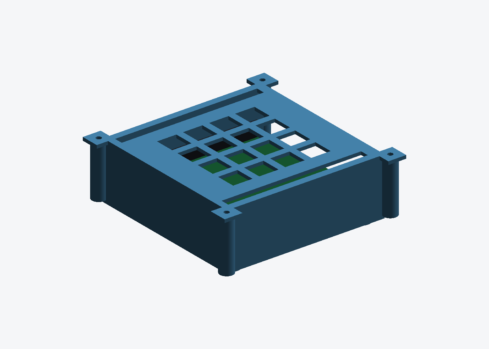

# AURIX Application Kit TC3X7 case

Tray + vented lid for Infineon's **Application Kit TC3X7 V2.0** — the 100 × 100
board family sold with TC397, TC387 and TC377 assembled
(`KIT_A2G_TC397_5V_TFT` / `KIT_A2G_TC397_3V3_TFT` and siblings).



| | |
|---|---|
| Tray | 119.0 × 119.0 × 38.3 mm, 65.3 cm³ |
| Lid | 122.0 × 122.0 × 2.2 mm, 17.6 cm³ |
| Outside | 106.8 × 105.9 × 38.0 mm |
| Fasteners | 2 × M3 × 8 (board), 4 × M3 × 12 (lid) |

> This is **not** the TriBoard. The TriBoard is a 100 × 160 Eurocard; the
> Application Kit is 100 × 100. An earlier version of this folder was built for
> the wrong one.

## Where the numbers come from

Infineon's **Application Kit Manual TC3X7 V2.0** is public — no login:

<https://www.infineon.com/assets/row/public/documents/10/44/infineon-applicationkitmanual-tc3x7-usermanual-en.pdf>

The **Gerbers are not**. Infineon gates board design files behind product
registration, so figure 7-7 *"Dimensioning (mm)"* was measured instead — the
manual states it is "valid for all Application Kits". In that figure the PCB
outline is a 1476 × 1476 px square at 300 dpi, so 14.76 px/mm against the
stated 100 × 100 mm, and every feature below was read on that scale and
cross-checked against the drawing's own dimension chain.

| | Value | Check |
|---|---|---|
| Outline | **100 × 100 mm** | stated in §2, "100mm x 100mm" |
| Mounting holes | **2 × Ø6 mm pads at (11, 4) and (89, 4)** | the chain carries 11, 89 and 4 explicitly |
| Left header | x 2.87…5.41, y 2.70…94.95 | two pad columns, 2.54 mm apart |
| Right header | x 94.50…97.00, y 2.68…93.23 | same |
| Port edge | y = 100 | POWER, USB, RJ45, CAN, LIN, SD-card silkscreen sits on it |

Origin is the bottom-left corner of the drawing. **There is no mounting hole at
either top corner** — checked by cropping all four corners of the figure; the
top two carry connectors only. So the design uses real M3 standoffs on the two
holes that exist and a 1.6 mm perimeter shelf for the rest.

Still assumed: `PCB_T = 1.6`, `CORNER_R = 2.0`, and `INNER_H = 24` above the
board — the manual gives no component heights, and the TFT and the side headers
are the tall parts. Measure before ordering if you care about the height.

## Design

* Walls on three sides; the **y = 100 port edge is fully open**, so nothing has
  to line up with POWER, USB, RJ45, CAN, LIN or the SD slot.
* Two **slots in the lid** for the side expansion headers, 5.7 × 95.5 mm and
  5.7 × 93.8 mm, placed on the measured footprints — ribbon cables drop
  straight in with the lid on.
* Tray floor carries **4 × Ø3.4 on a 45 mm square**, matching the deck bosses
  on the printed LAN9692 box lid, so it bolts on top in either orientation.
  The acrylic frame's plate B is on 35 × 45 and does not take this tray as
  generated — change `DECK_HOLES['pitch']` to a `(35, 45)` pattern for that.

## Regenerating

```bash
pip3 install --break-system-packages trimesh manifold3d
python3 tc397_appkit_case.py    # -> tc397_appkit_{tray,lid}.stl
```

## Printing

MJF PA12 or FDM PETG/ABS, both parts flat, no supports. 83 cm³ for the pair.
