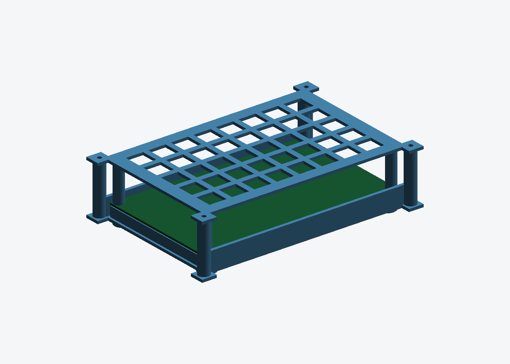

# AURIX TC397 TriBoard case

Tray + vented lid for the Infineon AURIX TC397 TriBoard, Eurocard 100 × 160 mm.



| | |
|---|---|
| Tray | 122.0 × 182.0 × 44.3 mm, 61.0 cm³ |
| Lid | 122.0 × 182.0 × 31.9 mm, 28.5 cm³ |
| Outside | 112 × 165 × 44 mm |
| Fasteners | 4 × M3 × 12 |

## What is data and what is not

**Exact:** the **100 × 160 mm Eurocard** form factor Infineon gives for the
TC3x7 TriBoard.

**Not available, so not designed around:**

* **Mounting holes.** Infineon's board pages render client-side and the Mouser
  and manuals.plus mirrors of the TriBoard manual both refuse automated
  fetches, so no hole pattern could be read. The board rests on a 2 mm
  perimeter shelf and is held by four pads under the lid instead.
* **Port positions.** Same reason — so **both 160 mm edges stay fully open**
  and walls only go on the two 100 mm edges. Nothing can be in the wrong place.
* **`INNER_H = 30`** above the board is a generous guess for a TriBoard's
  headers, and **`PCB_T = 1.6`**.

**Check the variant before printing.** This is sized for the *TriBoard*
(`KIT_A2G_TC397_5V_TRB_S` / `_3V3_TRB`). The Application Kits (`..._TFT`) and
the gateway kit (`..._24V_GTW`) are not Eurocards — for those, change `BW`/`BH`
at the top of the script and rerun. If you send me the manual's mechanical page
or four caliper numbers, the shelf becomes real standoffs and the open edges
become matched port windows, the way the LAN9692 box works.

## Stacking

The tray floor carries **4 × Ø3.4 holes on a 45 mm square**, matching the deck
bosses on the LAN9692 box lid, so it bolts on top — square pattern, so either
orientation works. Rotated 90° it measures 165 × 112 mm and sits inside the
LAN9692 lid's 233.8 × 155.7 mm footprint; unrotated it overhangs the depth by
about 9 mm. The tray's own feet are 2.5 mm and the deck bosses 4 mm, so the
feet hang clear.

## Regenerating

```bash
pip3 install --break-system-packages trimesh manifold3d
python3 tc397_case.py        # -> tc397_tray.stl, tc397_lid.stl
```

## Printing

MJF PA12 or FDM PETG/ABS, both parts flat, no supports. 90 cm³ for the pair.
